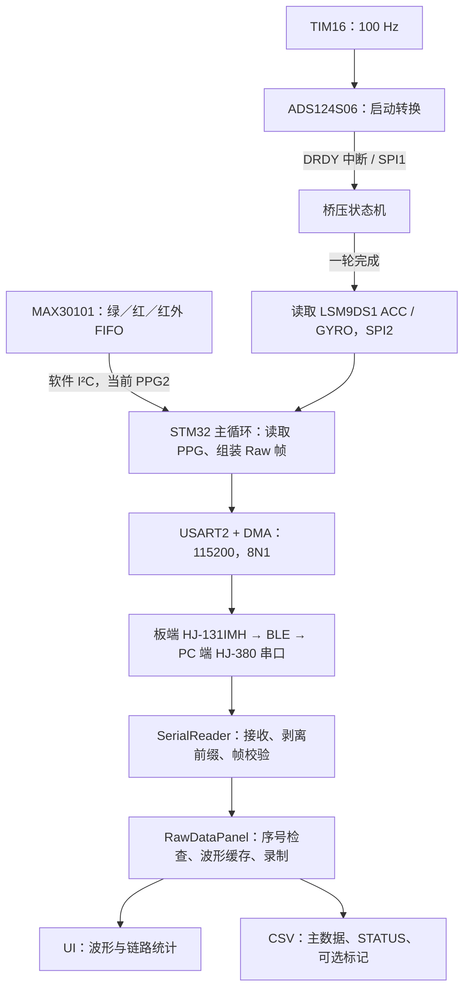

> 2026-09-15：当前入口为采集/烧录双页工作台；保留本文的多光谱采集设计，新增热膜原始/中值双数据。页面操作以[UI 说明](../上位机UI说明文档.md)为准，完整 CSV 字段见[文件结构](原始数据录制文件结构说明.md)。

# 多光谱原始数据采集核心功能指南

本文面向设备使用者和离线数据分析人员，介绍 STM32L452CEU6 固件、Python 上位机和 CSV 文件构成的完整采集链路。范围限定为 Green／Red／IR 三波长 PPG 与配套桥压、惯性数据的原始采集。

核对日期：2026-09-07。以当前工作区代码（含尚未提交的配置）为依据，不代表已读取实物设备上的固件。设备实际参数取决于最后一次编译和烧录的版本。部分旧注释和函数名仍沿用历史命名，本文以实际执行分支、寄存器写入和文件写入逻辑为准。

## 1. 项目采集什么

一次 Raw 数据帧包含 13 路传感器数值及一个设备序号：

| 数据组 | 通道 | 保存单位 | 用途 |
| --- | --- | --- | --- |
| 多光谱 PPG | Green、Red、IR | ADC 码值，可带小数 | 保存三个波长的光电信号 |
| 热膜桥压 | Uc1、Uc2、Ut1、Ut2 | mV | 保存两组桥中、桥顶电压 |
| 加速度 | AccX、AccY、AccZ | g | 记录运动及重力分量 |
| 角速度 | GyroX、GyroY、GyroZ | dps，即 °/s | 记录旋转运动 |
| 设备序号 | Seq | 无 | 判断帧连续性及补齐缺失位置 |

默认每秒生成约 100 个 Raw 帧，另有约 1 Hz 的 STATUS 诊断帧。磁力计数据不在当前 Raw 帧中。

这里的“原始数据”是**当前采集链路输出的传感器数据**，已经包含硬件平均、固件平均、位宽截取、轴向处理和单位换算，具体见第 3 节，不能理解为所有传感器每一次内部转换的逐点原样转储。

## 2. 系统架构与当前配置

### 2.1 数据路径



固件采用 HAL 初始化、主循环和中断协作。采样触发、ADC 完成通知、组帧和发送分属不同阶段；没有把 UI 的刷新周期作为设备采样时钟。

### 2.2 模块职责

| 模块 | 主要文件 | 职责 |
| --- | --- | --- |
| 系统配置 | `Core/Inc/main.h` | 选择 Raw 输出、PPG 物理通道、目标采样率及 BLE 配置开关 |
| 采样参数 | `Core/Inc/sample_rate_config.h` | TIM16 分频、多光谱时隙、MAX30101 采样和 FIFO 平均参数 |
| 调度与组帧 | `Core/Src/main.c` | 上电初始化、ADC 状态机、PPG 平均、Raw/STATUS 组帧与发送计数 |
| PPG 通道层 | `Core/Src/ppg_channel.c` | 将统一 PPG 接口分派至选中的物理总线 |
| PPG 驱动 | `MAX30101.c`、`MAX30101_2.c`、`MyIIC.c`、`MyIIC_2.c`，均在 `Core/Src/` | 两组软件 I²C 与 FIFO 读写 |
| 模拟电压 | `Core/Src/ADC_ADS124.c` | ADS124S06 寄存器配置、通道切换和 SPI1 读数 |
| 惯性数据 | `Core/Src/MIMU.c` | LSM9DS1 配置、SPI2 读取及陀螺仪零偏处理 |
| 外设 | `Core/Src/tim.c`、`usart.c`、`dma.c`、`gpio.c` | 定时器、串口、DMA 和引脚初始化 |

### 2.3 当前默认值

| 配置 | 当前值 | 含义 |
| --- | --- | --- |
| `ENABLE_RAW_DATA_PACKET` | `1` | 启用原始数据输出 |
| `CURRENT_WORK_MODE` | `MODE_HEART_RATE` | 历史宏名；当前此分支实际配置三波长 Multi-LED 采集 |
| `PPG_DEFAULT_CHANNEL` | `2` | 选 PPG2，即软件 I²C2：PB0=SCL、PB1=SDA |
| `PPG_SAMPLE_RATE` | `100` | 目标 Raw 帧率 100 Hz |
| `ENABLE_BLE_CONFIG` | `0` | MCU 上电不自动发送 BLE 配置指令，使用模块已有配置 |
| `BLE_CUSTOM_MAC` | `784128c58150` | 上位机连接的目标地址；固件和 Python 常量需对应实际设备 |
| USART2 | `115200 / 8N1` | 8 数据位、无校验、1 停止位，无硬件流控 |

PPG1 和 PPG2 表示两条物理连接通道，不表示两种颜色。当前只选 PPG2，但在该 MAX30101 内依次采集绿、红、红外三路。PPG1 对应 PA0/PA1。

当前三波长参数如下，最终配置由 `main.c` 中 `PPG_Config_Green_Hardcoded()` 写入：

| 项目 | 当前值 |
| --- | --- |
| Multi-LED 模式 | `MODE_CONFIG=0x07` |
| LED 时隙 | SLOT1=Green、SLOT2=Red、SLOT3=IR；控制寄存器 `0x13 / 0x02` |
| Green / Red / IR 电流寄存器 | `0xE0 / 0xC0 / 0xC0` |
| 采样配置 | `0x6F`：内部 400 sps、411 μs、18 bit、ADC 量程 16384 nA |
| FIFO 配置 | `0x3F`：2 次硬件平均、允许回卷 |
| 每个 FIFO 样本 | 9 字节，Green／Red／IR 各 3 字节 |

这些是编译时参数，UI 不会动态修改它们。本指南的采集和时间轴说明均以当前 100 Hz 为准；不要只改固件采样率后继续沿用此上位机时间轴常量。

## 3. 单片机如何完成一帧采集

### 3.1 启动与周期调度

1. 初始化时钟、GPIO、DMA、SPI1、SPI2、USART2 和定时器，打开传感器电源。
2. 检查并初始化 ADC、PPG 等模块，初始化 IMU，加载历史陀螺仪零偏并执行启动标定。
3. 写入三波长 PPG 的最终配置、清空 FIFO 指针。
4. 启动 TIM16，以 100 Hz 触发 ADC 转换。ADC 的 DRDY 外部中断读取电压并推进通道状态机。
5. 一轮 ADC 完成后读取 ACC 和 GYRO。主循环随后读取 PPG FIFO、完成组帧，通过 UART DMA 发出。

ADC 检查失败时启动流程会循环等待，因此串口已打开但没有 Raw 帧，不一定是 PC 解析问题。

每次启动会执行陀螺仪暖机、800 点均值采集和额外 200 点稳定性检查，期间应保持设备静止。标定通过后更新零偏并写入 Flash；未通过则保留之前加载的零偏（无历史值时为 0）。应等启动标定结束、Raw 数据稳定到达后再开始实验。

### 3.2 三路 PPG：两级平均后输出

当前 MAX30101 内部 400 sps，经 2 次硬件平均后，FIFO 有效输出名义上为 200 组三波长样本/秒。MCU 按约 100 Hz 处理一轮，读取当时 FIFO 中的全部可读样本，再分别对三个波长求平均，因此通常每帧使用约 2 组 FIFO 样本，实际数量随时序变化。

固件以 Q4 定点数保存均值：

```text
N = 本轮 FIFO 可读样本数
Q4 = floor((sum × 16 + floor(N / 2)) / N)，N > 0
PC 保存值 = Q4 / 16
```

CSV 因而允许 1/16 ADC 码值的步进。它保留平均产生的小数，并不意味着传感器单次 ADC 分辨率增加。

若 FIFO 空读，固件沿用上一次有效均值，同时增加 FIFO 空读计数；尚无有效样本时缓存初值为 0。**重复 PPG 值可能来自空读保持或平均结果相同，不等价于丢包。**

三种颜色通过 LED 时隙依次采集，且传感器 FIFO 与 MCU 定时器异步运行。同一 Raw 帧表示一次组合输出，不保证各传感器、各颜色严格在同一物理时刻采样。

### 3.3 桥压：四列的更新频率不同

ADS124S06 经 SPI1 顺序转换桥压。当前状态机中，桥顶 Ut1、Ut2 每轮更新，目标约 100 Hz；桥中 Uc1、Uc2 分别每 10 轮更新一次，稳态约 10 Hz，两路错开调度。未更新时帧内继续携带已有值。因此主文件虽然每秒约 100 行，不能把四路桥压都视为 100 Hz 的独立新转换。

ADC 原始转换为 24 bit，但 `ADC_RDATA()` 只发送高 16 bit，低 8 bit 未保存。上位机按以下现有实现换算：

```text
code = (第一个字节 << 16) | (第二个字节 << 8)
电压(mV) = code / 8388608 × 2.5 × 1000
```

该解析路径没有做 24 bit 负数符号扩展，分析时应按当前桥压用途解释这些列，不应直接将其当作通用双极性 24 bit ADC 原始数据。

### 3.4 惯性数据：119 Hz 内部输出，100 Hz 读取

LSM9DS1 的 ACC 和 GYRO 当前内部输出率均为 119 Hz，MCU 每轮读取最新寄存器数据。它们在 Raw 文件中的名义节拍为 100 Hz，不是完整导出的 119 Hz 内部序列。

| 通道 | 当前处理 |
| --- | --- |
| ACC | ±4 g，16 bit；设置 50 Hz 防混叠带宽，输出保留重力分量；固件将 Z 轴取反；PC 按有符号值 × `4/32767` 换算成 g |
| GYRO | ±500 dps，16 bit；当前启用内部高通，固件打包前扣除当前零偏；PC 按有符号值 × `0.0175` 换算成 dps |

CSV 中的角速度已经过上述处理，不是未补偿的寄存器码值。

### 3.5 序号与发送

Raw 帧组装完成后尝试启动 DMA，无论启动成功、忙或报错，随后都会递增 `raw_packet_seq`。序号范围为 0～65535，正常回绕到 0。因此 Seq 缺口可覆盖已组帧但未成功启动发送的情况。

但 Seq 并非每次 TIM16 中断直接递增：它不能单独证明所有定时采样都完成。需要结合 STATUS 中的采样、组帧和发送计数判断链路情况。当前 Raw 发送忙或出错后没有逐帧重传机制。

## 4. 单片机与上位机之间的数据格式

### 4.1 Raw 帧：35 字节

所有多字节字段均高字节在前。字节偏移从 0 开始。

| 偏移 | 字段 | 编码 |
| --- | --- | --- |
| 0～1 | 帧头 | `AA BB` |
| 2～3 | Ut2 | ADC 高 16 bit |
| 4～5 | Ut1 | ADC 高 16 bit |
| 6～7 | Uc2 | ADC 高 16 bit |
| 8～9 | Uc1 | ADC 高 16 bit |
| 10～15 | AccX、AccY、AccZ | 各 2 字节，有符号 16 bit |
| 16～21 | GyroX、GyroY、GyroZ | 各 2 字节，有符号 16 bit |
| 22～24 | PPG Green | 3 字节无符号 Q4 均值 |
| 25～27 | PPG Red | 3 字节无符号 Q4 均值 |
| 28～30 | PPG IR | 3 字节无符号 Q4 均值 |
| 31～32 | Seq | 无符号 16 bit |
| 33 | XOR | 字节 2～32 的异或 |
| 34 | 帧尾 | `CC` |

注意串口帧桥压顺序为 Ut2、Ut1、Uc2、Uc1，CSV 会重排为 Uc1、Uc2、Ut1、Ut2。Raw 帧没有逐帧 MCU 时间戳、采样率或单路数据新鲜度标记。

### 4.2 STATUS 帧：69 字节

当前协议版本为 2，帧头 `AA DD`，字节 2 为版本，字节 3～66 为 16 个大端 uint32 值，字节 67 为字节 2～66 的 XOR，字节 68 为 `CC`。内容依次为 MCU 时间、采样、ADC DRDY、组帧、发送启动、发送完成、发送忙、发送错误、ADC 错误、IMU 错误，以及 6 个 PPG FIFO 统计值。

TIM16 每累计 100 次采样触发设置发送标志，在 Raw DMA 完成回调中尝试发送 STATUS，故其名义频率为 1 Hz，实际发送时刻受 Raw 发送进度影响。

## 5. 上位机如何采集和显示

### 5.1 接收处理

`tools/monitor/main.py` 将串口线程连接到 Raw 面板。`serial_reader.py` 在独立 QThread 中打开 115200、8N1 串口，读取超时为 10 ms，每次按缓冲区现有数据读取，单次最多 276 字节；串口一次读到的块不要求与一帧对齐。

当前 HJ-380 连接流程先发送 `<ST_CENTER_LINK=ALL>` 断开已有连接，再发送 `<ST_CON_MAC=784128c58150>` 绑定目标设备。接收状态机处理 HJ-380 的 `From ... MAC: ` 前缀和 AT 应答，识别 Raw、STATUS 帧并检查长度、帧头、帧尾及 XOR，成功后交给对应面板。MAC 配置结果不能代替“正在持续收到有效数据”的检查。

`raw_quality.py` 按 16 bit 模运算比较序号，识别正常回绕、前向缺口、重复和乱序。重复、乱序帧不进入波形缓冲和主 CSV；损坏帧不会生成有效数据行。缺失位置需等后续有效序号到达后才能推断。

### 5.2 波形与录制的关系

Raw 面板展示三色 PPG、四路桥压、三轴加速度、三轴角速度，并显示接收率、序号推算速率、丢包率和诊断统计。

- 波形缓存每路最多 2000 点，显示最近 800 点；无缺口且 100 Hz 时约为最近 8 秒。
- 波形每 33 ms 刷新一次，约 30 FPS；保存按接收到的有效帧逐包执行，不按刷新帧率抽样。
- 波形横轴按缓存点排列，显示缓冲不插入缺失占位点；CSV 则补齐序号缺口，二者在丢包时的点位含义不同。
- PPG 图中按 `ADC码值 / 16` 显示为近似 nA；CSV 的 PPG 列保留 ADC 码值。这里是显示单位换算，和协议 Q4 解码是两个独立步骤。

“连接”仅建立接收通道；“录制”才开始创建并写入文件。设备按自身固件持续采集，点击录制不会向 MCU 发送开始采样指令，停止录制也不会让 MCU 停止采样。

### 5.3 一次实验的操作步骤

在项目根目录准备环境并启动：

```powershell
conda activate ppg-prj
pip install -r tools/monitor/requirements.txt
python tools/monitor/main.py
```

1. 给采集设备上电并保持静止，等待启动标定完成；接入 PC 端 HJ-380，刷新并选择对应 COM 口，点击“连接”。
2. 切换到“原始数据”面板，确认 Green／Red／IR 都有数据、接收率接近 100 Hz，并观察丢包及 FIFO 诊断。
3. 点击“实验信息”，填写保存根目录、场景、实验编号、受试者缩写、日期，核对文件预览。受试者缩写为 1～8 位大写 ASCII 字母，编号为正整数。
4. 点击“录制”，确认状态栏显示目标路径。录制从此后收到的首个有效帧开始，之前的显示缓存不会补写。
5. 在动作开始、结束或其他事件处点击“标记”；界面按钮默认只记录序号，`Note` 为空，可另行记录各标记的实验含义。
6. 实验结束点击停止录制，完成文件刷新和关闭，再断开连接。下一次实验重新核对编号和路径。

UI 会建议下一实验编号；若同名主文件、诊断文件或标记文件任一个已存在，录制入口会拒绝覆盖。不要在录制中使用“清屏”：当前清屏逻辑会重置统计并停止录制。断开连接本身没有自动停止 Raw 录制的逻辑，因此应先停止录制。

无硬件时可运行 `python tools/monitor/main.py --raw-simulate` 演练 UI 和保存流程；模拟数据仅用于软件演练。

## 6. 保存位置与文件组成

### 6.1 目录与命名

```text
<保存根目录>/
└── <YYYYMM>-multiperson/
    └── <MMDD>-<SUBJECT>/
        ├── <scenario><trial>_<SUBJECT>_<MMDD>.csv
        ├── <scenario><trial>_<SUBJECT>_<MMDD>_status.csv
        └── <scenario><trial>_<SUBJECT>_<MMDD>_markers.csv  （有标记才创建）
```

例如 2026 年 9 月 7 日、受试者 LYX、第 1 次静息实验：

```text
202609-multiperson/0907-LYX/rest1_LYX_0907.csv
202609-multiperson/0907-LYX/rest1_LYX_0907_status.csv
202609-multiperson/0907-LYX/rest1_LYX_0907_markers.csv
```

场景代码由 UI 选项生成，例如静息 `rest`、跑步 `run`、开机 `kaiji`、敲键盘 `jianpan`、开合跳 `kaihe`。完整选项定义在 `recording_naming.py`。

文件为逗号分隔、有表头的文本 CSV，编码为 UTF-8 BOM（`utf-8-sig`）。主文件和 STATUS 文件开始录制时创建；标记文件至少点击一次标记才创建，没有标记文件属于正常情况。

### 6.2 主 CSV：20 列，固定顺序

```csv
Time(s),SampleIndex,Seq,ValidFlag,InterpFlag,GapLen,MissingBefore,Uc1(mV),Uc2(mV),Ut1(mV),Ut2(mV),AccX(g),AccY(g),AccZ(g),GyroX(dps),GyroY(dps),GyroZ(dps),PPG_Green,PPG_Red,PPG_IR
```

| 列 | 含义与取值 |
| --- | --- |
| `Time(s)` | `SampleIndex / 100`，保留 3 位小数；录制数据的名义采样时间 |
| `SampleIndex` | 本次录制首个有效帧为 0，此后按序号推进，包含缺失位置 |
| `Seq` | 设备 16 bit 序号；有效行取自帧，缺失行根据前后序号推算 |
| `ValidFlag` | 1=接收到且通过检查的帧；0=缺失占位行 |
| `InterpFlag` | 当前始终为 0，采集端不执行插值 |
| `GapLen` | 缺失行所属连续缺口的长度；有效行为 0 |
| `MissingBefore` | 有效帧前紧邻的缺失数，无缺失为 0；占位行为空 |
| `Uc1(mV)`、`Uc2(mV)` | 桥中 1、2；保留 5 位小数 |
| `Ut1(mV)`、`Ut2(mV)` | 桥顶 1、2；保留 5 位小数 |
| `AccX(g)`、`AccY(g)`、`AccZ(g)` | 三轴加速度；保留 5 位小数 |
| `GyroX(dps)`、`GyroY(dps)`、`GyroZ(dps)` | 三轴角速度；保留 3 位小数 |
| `PPG_Green`、`PPG_Red`、`PPG_IR` | 已除以 Q4 比例 16 的 ADC 均值码，保留实际小数 |

小数位数是保存格式，不是物理测量精度。`ValidFlag=1` 仅表示帧有效，不保证 PPG 本轮读取到新样本，也不保证传感器已良好贴合或没有饱和。

### 6.3 缺失行示例与时间轴边界

假设录制先收到 Seq=100，然后收到 Seq=103，主文件前 7 列如下：

```csv
Time(s),SampleIndex,Seq,ValidFlag,InterpFlag,GapLen,MissingBefore
0.000,0,100,1,0,0,0
0.010,1,101,0,0,2,
0.020,2,102,0,0,2,
0.030,3,103,1,0,0,2
```

上述为节选示例；实际每行有 20 列，两个缺失行的 13 个传感器字段全部写为 `NaN`。这种方式保留时间位置，不会伪造测量值。

主文件时间不是串口到达时间，也不是 MCU 实测时间戳。首帧之前、最后一帧之后的缺失无法仅凭 Raw 序号补出；设备重启和长时间中断也不能作为正常连续录制处理。建议设备重启或重连后开始新的实验文件，避免跨设备会话解释 Seq。

离线分析应保留这些缺失位置。直接删除 NaN 后重新按 100 Hz 排列会压缩时间轴；插值应在后续分析中单独执行并记录。

### 6.4 STATUS CSV：25 列诊断快照

完整表头：

```csv
RxTime(s),McuTime(ms),SampleCounter,FrameCounter,TxStartCounter,TxDoneCounter,TxBusyCounter,TxErrorCounter,AdcDrdyCounter,AdcErrorCounter,ImuErrorCounter,PpgFifoEmptyCounter,PpgFifoOverflowCounter,PpgFifoSampleTotalCounter,PpgFifoNonemptyCounter,PpgFifoSingleSampleCounter,PpgFifoMultiSampleCounter,PcReceivedRaw,PcExpectedRaw,PcMissingRaw,PcMissingAfterTxDone,TxInflight,PcRawTotalCandidates,PcRawInvalidCandidates,PcRawInvalidDelta
```

| 字段 | 解释 |
| --- | --- |
| `RxTime(s)` | PC 处理 STATUS 时距点击录制的墙钟时间 |
| `McuTime(ms)` | MCU `HAL_GetTick()` 时间，启动后毫秒计数 |
| `SampleCounter` | TIM16 采样触发累计次数 |
| `FrameCounter` | 已组装并尝试发送的 Raw 帧累计数 |
| `TxStartCounter` / `TxDoneCounter` | Raw DMA 成功启动数 / 完成回调数 |
| `TxBusyCounter` / `TxErrorCounter` | Raw DMA 忙次数 / 发送错误计数 |
| `AdcDrdyCounter` | ADC DRDY 次数；一轮涉及多个转换，不能直接等同 Raw 帧数 |
| `AdcErrorCounter` / `ImuErrorCounter` | 固件诊断字段；当前 ADC 计数针对状态机异常，IMU 字段尚未接入错误递增逻辑，不能据此证明所有硬件读写正常 |
| `PpgFifoEmptyCounter` | FIFO 可读数为 0 的次数 |
| `PpgFifoOverflowCounter` | 当前按可读样本数 ≥31 累计的近满告警次数，并非硬件溢出寄存器的精确丢样总数 |
| `PpgFifoSampleTotalCounter` | 各轮 FIFO 可读样本数之和 |
| `PpgFifoNonemptyCounter` | 非空轮数 |
| `PpgFifoSingleSampleCounter` / `PpgFifoMultiSampleCounter` | 单样本轮数 / 多样本轮数 |
| `PcReceivedRaw` | PC 序号统计接收计数，含随后被识别为重复或乱序的帧，不一定等于 CSV 有效行数 |
| `PcExpectedRaw` / `PcMissingRaw` | 按序号推算的期望位置数 / 缺失数 |
| `PcMissingAfterTxDone` | 首个 STATUS 建立基线后，MCU 完成增量减 PC 接收增量，下限截为 0 |
| `TxInflight` | `max(TxStartCounter - TxDoneCounter, 0)` |
| `PcRawTotalCandidates` / `PcRawInvalidCandidates` | 串口解析器累计 Raw 候选帧数 / 无效候选帧数 |
| `PcRawInvalidDelta` | 相邻诊断快照间的无效候选帧增量 |

MCU 计数通常从设备启动累计；面板序号统计在开始录制时重置；解析器候选帧统计从串口会话累计。不同字段的起点不完全一致，诊断时优先比较同一连续会话内的增量。STATUS 文件不保存协议版本字段。

`PcMissingAfterTxDone` 有助于发现 MCU 完成发送之后的差额，但 PC 缓冲、接收时序和重复帧也会影响它，不能凭单个瞬时值认定 BLE 永久丢包。

### 6.5 标记 CSV：4 列

```csv
Elapsed(s),SampleIndex,MarkerNo,Note
```

- `Elapsed(s)`：点击标记时距点击录制的墙钟秒数，保留 3 位小数。
- `SampleIndex`：标记时最近已接受的数据位置，包含前面推断的缺失；尚未收到数据时为 0。
- `MarkerNo`：本次录制从 1 开始递增。
- `Note`：备注字段；当前 UI 点击按钮默认写空字符串。

对齐波形优先使用 `SampleIndex`；`Elapsed(s)` 与主文件 `Time(s)` 起点和计算方式不同，可能包含首帧等待、传输延迟及操作延迟。标记是 PC 端事件，不是 MCU 硬件同步触发记录。

### 6.6 写盘与实验元信息

主文件每累计接收 100 个录制有效帧执行一次 `flush()`；STATUS 每帧刷新，标记每次写入刷新；停止录制时刷新并关闭文件。刷新不等同于每行执行物理磁盘同步，应通过正常停止完成文件收尾。

当前不额外生成元信息 JSON，也不保存原始串口二进制文件。LED 电流、固件版本、佩戴部位、设备编号、标记含义等不在主 CSV 中自动记录。实验交付时应另附实验记录，至少注明固件/参数版本、100 Hz、PPG2、受试者、场景、佩戴位置和标记说明。

## 7. 如何判断一次采集是否可用

先看主文件有效行和缺失位置，再结合 STATUS 判断来源：

| 现象 | 检查方向 |
| --- | --- |
| Seq 出现前向缺口、主文件有 NaN | 查看 `TxBusyCounter`、`TxErrorCounter`、`PcMissingAfterTxDone` 和无效候选帧增量，区分发送与接收问题 |
| Seq 连续但 PPG 三路重复 | 查看 FIFO 空读及单/多样本计数；不能按重复值直接算丢包 |
| 桥中两路呈台阶状 | 与约 10 Hz 更新、100 Hz 持有输出的实现对照 |
| 只有文件表头 | 录制期间可能未收到对应有效帧；STATUS 文件也可能因录制太短而暂无数据 |
| 没有 `_markers.csv` | 核对是否在录制期间点过标记 |
| CSV PPG 数值约为 UI 数值的 16 倍 | 属于 ADC 码值与 nA 显示换算的预期差异 |

Python 读取示例（需要 pandas）：

```python
from pathlib import Path
import pandas as pd

path = Path("202609-multiperson/0907-LYX/rest1_LYX_0907.csv")
df = pd.read_csv(path, encoding="utf-8-sig")
missing = df["ValidFlag"].eq(0)
print("总位置数:", len(df))
print("有效行数:", df["ValidFlag"].eq(1).sum())
print("文件内缺失比例:", missing.mean() if len(df) else 0.0)

# 保留原时间轴和 NaN，便于识别连续有效片段。
ppg = df[["Time(s)", "SampleIndex", "ValidFlag",
          "PPG_Green", "PPG_Red", "PPG_IR"]]
```

文件内缺失比例只反映已推断并写入的缺口，不代表开机至关机整个过程的完整率。仓库另提供 `tools/monitor/ppg_quality_report.py`，可对主 CSV 检查 PPG 小数、重复三元组及序号缺失。

## 8. 维护与核对入口

本指南的事实来源为当前代码：

- 配置与采样流程：[main.h](../../Core/Inc/main.h)、[sample_rate_config.h](../../Core/Inc/sample_rate_config.h)、[main.c](../../Core/Src/main.c)。
- 数据解析：[protocol.py](../../tools/monitor/protocol.py)、[serial_reader.py](../../tools/monitor/serial_reader.py)。
- UI 与录制：[dashboard.py](../../tools/monitor/dashboard.py)、[raw_data_panel.py](../../tools/monitor/raw_data_panel.py)。
- 序号诊断与命名：[raw_quality.py](../../tools/monitor/raw_quality.py)、[recording_naming.py](../../tools/monitor/recording_naming.py)。

进一步查阅：[原始数据录制文件结构说明](原始数据录制文件结构说明.md)、[MAX30101项目配置说明](../hardware/MAX30101项目配置说明.md)、[ADS124S06配置说明](../hardware/ADS124S06配置说明.md)、[LSM9DS1配置说明](../hardware/LSM9DS1配置说明.md)。配置变化后应重新核对本指南中的默认值、数据单位和采样时间轴。
