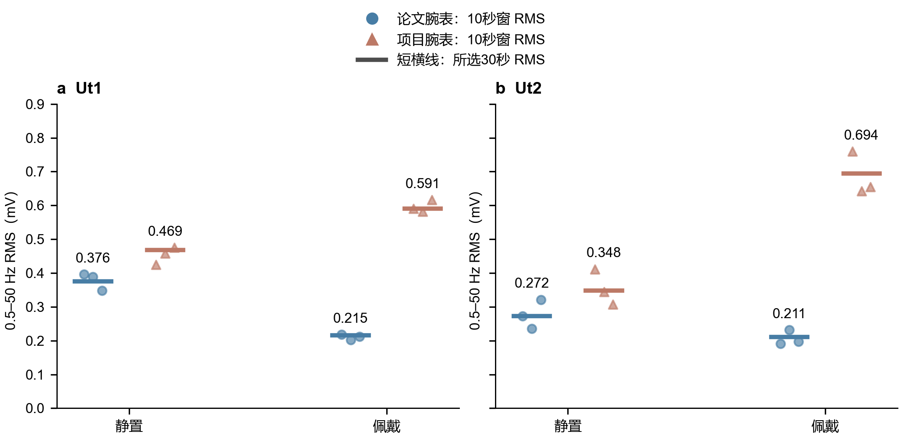
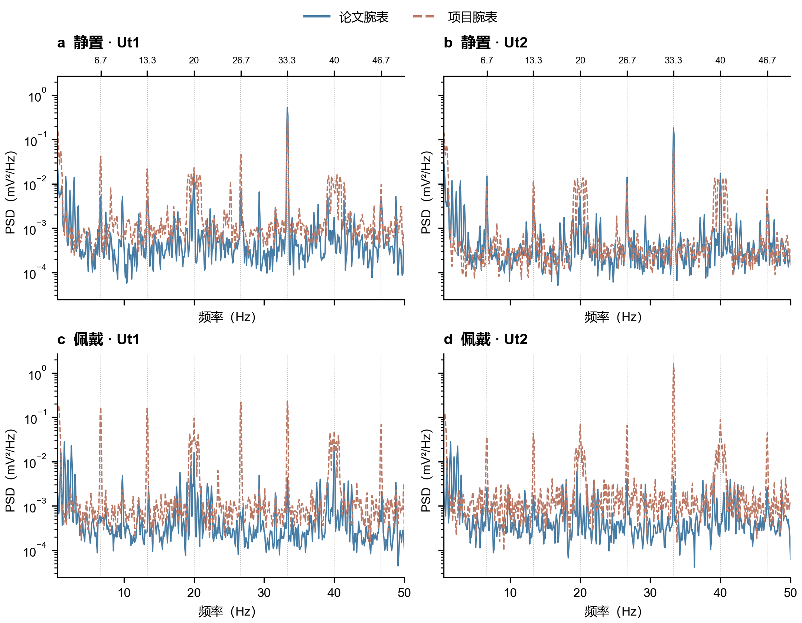
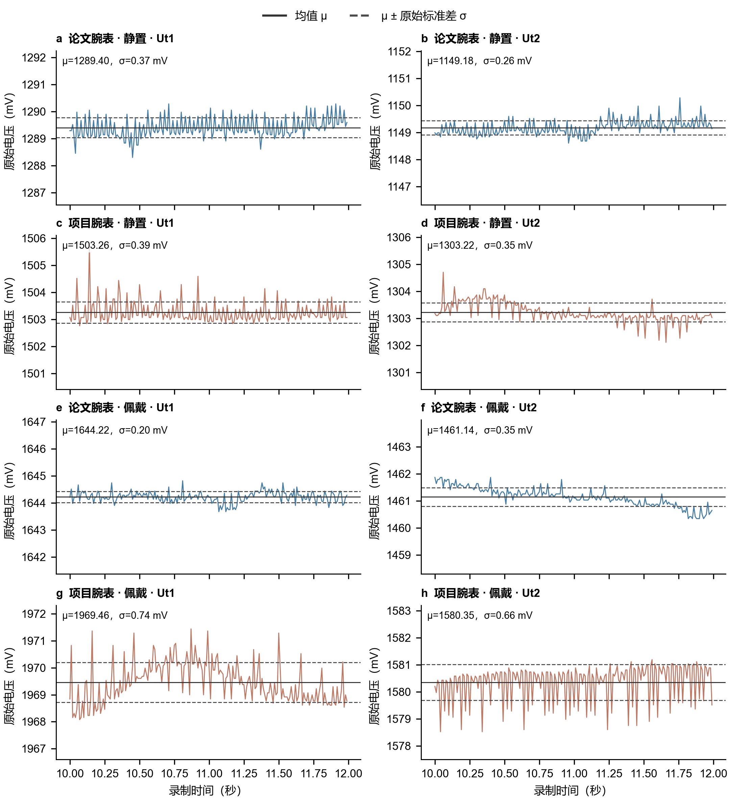
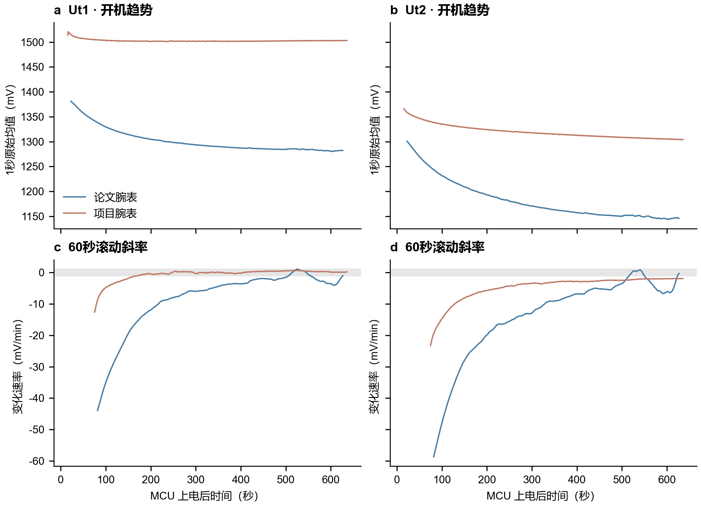
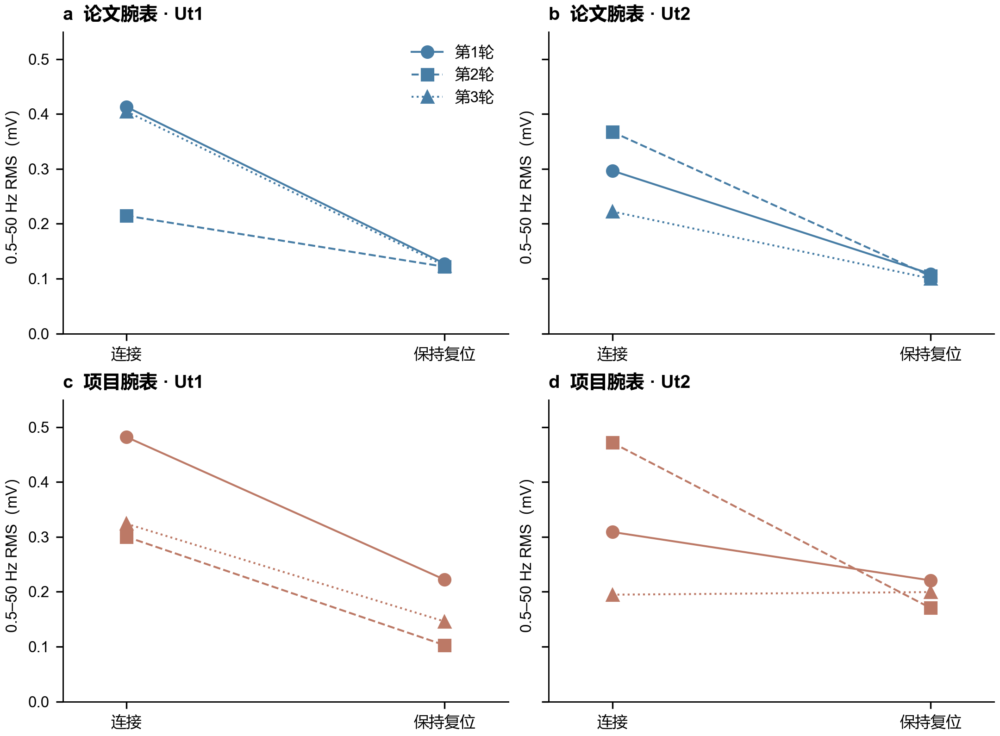
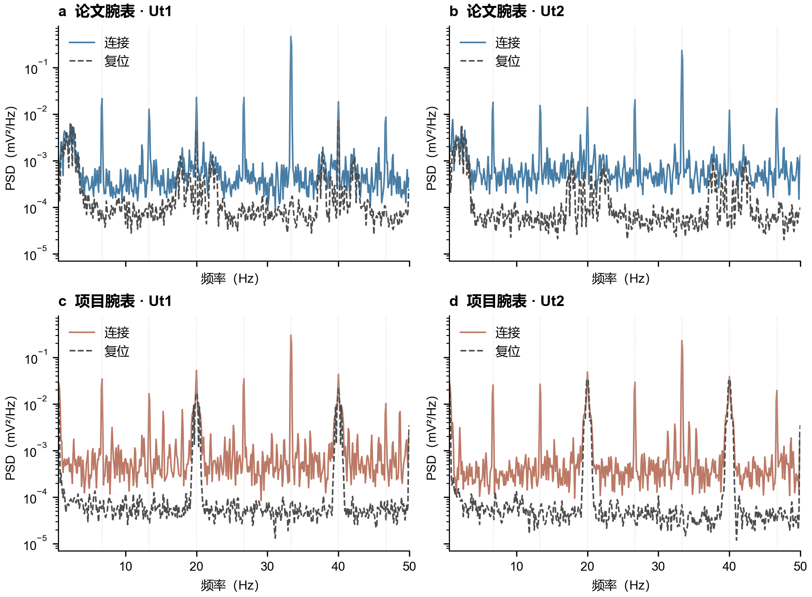
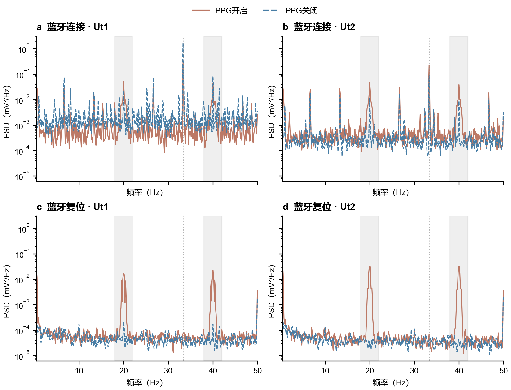
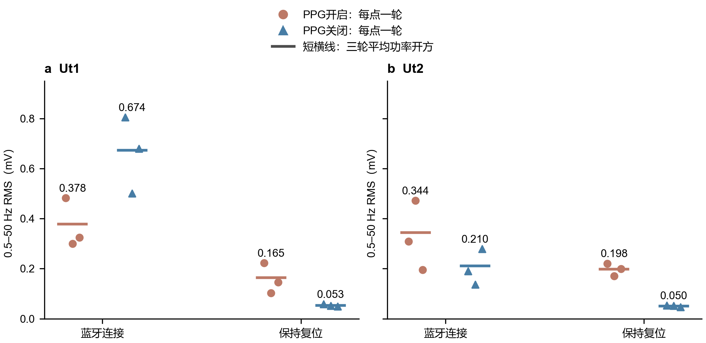

# 热膜噪声：聚焦修订与蓝牙复位对照

2026-09-15 · 统一评价指标：**0.5–50 Hz 频带 RMS，单位 mV**。

## 核心结论

**新增PPG关闭对照表明：项目腕表在蓝牙保持复位时，20/40 Hz残余峰随PPG/IIC一同关闭而降至接近背景，两路0.5–50 Hz RMS由0.165/0.198降至0.053/0.050 mV。这强烈支持PPG相关活动是残余扰动的重要来源，但尚不能区分芯片内部采样与IIC读操作。蓝牙连接时Ut1反而变吵，因此关闭PPG并非所有工况都能降低总噪声。详见第7节。**

新静置记录的前30秒，项目两路RMS约为论文腕表的1.25/1.28倍；佩戴记录约为2.74/3.30倍。静置Ut1差距随取段明显变化，不能把一个倍数当成整机固定属性。

## 口径与取段

- **主比较：各段前30秒。** 既保留相同时长，也避开已知项目佩戴记录约46秒的阶跃。项目静置用新增第二次记录，佩戴沿用第一次记录；因此图中项目静置→佩戴不视为同次开机配对。另用第一次静置数据验证自身前后变化。
- **原始展示：各段固定10–12秒。** 片段短、基线变化较小，适合看脉冲形态；不是挑选最低RMS，也不凭两秒波形给整段排名。
- **复位对照：每个30秒阶段中间20秒，即阶段开始后5–25秒。** 按MCU事件/样本计数定位，剔除开关附近过渡；附加10–20秒检查敏感性。
- RMS由Welch PSD在0.5–50 Hz内积分开方；100 Hz采样、10秒周期Hann窗、50%重叠、每窗去线性趋势、0.1 Hz频点间隔，**包含50 Hz奈奎斯特频点**。这是频域排除慢基线的统一口径，不是理想砖墙高通滤波器。有限窗仍有少量谱泄漏，佩戴的带内真实热/生理变化也可能贡献RMS。[方法依据](https://docs.scipy.org/doc/scipy/reference/generated/scipy.signal.welch.html)

已核验本次纳入的11份记录，未发现缺帧、插补、重复序号或相关错误计数增长。两表硬件相同；普通记录均纯电池、无线接收；新记录其他条件相同，仅改善静置/防风。复位实验均未佩戴、防风静置、HJ-380保持插入、电池加USB、有线接收。**两类供电条件分开分析，不直接相减归因。第1–6节保留原PPG配置的结果，第7节加入项目腕表PPG关闭对照。**

## 1. 统一RMS后的对比

**图1｜散点表示各自连续10秒窗的RMS，每组3个；短横线表示完整30秒的Welch RMS。** 蓝色圆点为论文腕表，陶土色三角为项目腕表。三个点是同一记录内的时间变化，不是三台器件或三次独立实验。没有显著性检验。

| 工况 | 通道 | 论文腕表 | 项目腕表 | 项目/论文 |
|---|---|---:|---:|---:|
| 静置，新项目记录 | Ut1 | 0.376 | 0.469 | 1.25× |
| 静置，新项目记录 | Ut2 | 0.272 | 0.348 | 1.28× |
| 佩戴，原记录 | Ut1 | 0.215 | 0.591 | 2.74× |
| 佩戴，原记录 | Ut2 | 0.211 | 0.694 | 3.30× |

**同次开机前后：**论文腕表Ut1/Ut2佩戴后分别下降43%/23%。使用项目腕表第一次静置作为配对基线，0.505/0.395→0.591/0.694 mV，分别上升17%/76%。这些均为前30秒口径。

**取段限制不能省略：**新项目静置Ut1前30秒0.469、前60秒0.625、末30秒0.721 mV；论文相应为0.376、0.316、0.255 mV。新项目慢基线更平稳，但快速周期分量依然随时间变强。Ut2前60秒比较则是0.358 vs 0.321 mV，仅1.12倍。结论宜表述为“静置差距较佩戴小、尤其Ut1有明显时间依赖”，不是固定双通道倍数。

## 2. 其他谱峰意味着什么？

**图2｜与图1相同30秒片段，原始信号PSD、同一对数纵轴。** 上方标出约6.7 Hz等间隔频率；虚竖线只是频率定位，不是已知硬件源标签。

可把峰分为两类理解：

1. **6.7、13.3、26.7、33.3、46.7 Hz等窄峰：模块活动相关的周期分量。** 后面的复位实验中，这些带功率普遍下降约97–99%以上，33.3 Hz约下降99.9%。因此关联证据比“看到33 Hz猜蓝牙”更强。多个峰可能是非正弦脉冲的谐波、调制或采样后的混叠，不必对应多个独立故障源。
2. **约20、40 Hz附近：叠加了复位后仍保留的分量，项目腕表更明显。** 它们也是上面等间隔频率的一部分，但不能全部归入同一机制。项目复位段峰位约在19.6–20.1与39.8–40.4 Hz，幅度随轮次变化。说明同一频率邻域可以同时容纳模块活动相关成分和其他周期过程。

新增对照已将20/40 Hz残余的首要解释收敛到**PPG相关活动**（第7节）。ADC采样/接口时序与供电、参考耦合仍可能是干扰进入测量的路径，但不能仅凭峰频确定具体任务或芯片内部频率。ADC接口与转换时序相互作用产生杂散的机制可参见厂商工程讨论。[ADC时钟与接口时序讨论](https://www.analog.com/en/resources/analog-dialogue/articles/sigma-delta-adc-clocking-more-than-jitter.html)

100 Hz采样只直接观察0–50 Hz；例如66.7 Hz可折叠到33.3 Hz、80 Hz可折叠到20 Hz。这里仅说明“峰频不能唯一定位原频率”，不是说当前器件必定有这些高频源。更不能把33.3 Hz直接当成2.4 GHz射频本身或已测得的连接间隔。

## 3. 原始mV波形与均值±标准差

**图3｜未经平滑、高通或去趋势的原始电压。** 实线为该两秒片段的均值μ，虚线为μ±原始样本标准差σ；数字标注在各子图。所有子图电压跨度相同、中心不同，纵轴保持绝对mV，避免两表直流差异掩盖噪声形态。

原始σ包含片段内缓变基线，因此不必等于图1的频带RMS，也不应拿这两秒σ替代30秒指标。项目佩戴Ut1仍有缓慢起伏，Ut2的周期负脉冲很明显；完整佩戴后段更不平稳，目前不宜给它挑一个“完全稳定”的代表片段。

## 4. 开机后多久下降趋势不明显？

**图4｜上排是绝对电压的1秒均值，下排是60秒滚动线性斜率。** 横轴是各自MCU上电时间；项目采用新开机记录。灰带为±1 mV/min。首十几秒两表覆盖不同，因此不拟合共同上电初值或单一热时间常数。

为了避免凭肉眼硬定“稳定时间”，采用一个明确的描述性规则：60秒窗斜率绝对值小于阈值，且连续约120秒的后续滚动窗均满足。报告的是首个满足窗的**结束时间**，需要后续约2分钟数据才能确认；不是通用合格标准，也不代表之后永不偏离。

- **新项目Ut1：**约上电172秒（2.9分钟）开始满足±1 mV/min规则；更严格±0.5规则约241秒（4.0分钟）。末60秒斜率约+0.16 mV/min，可认为下降趋势已基本停止。
- **新项目Ut2：**约228秒（3.8分钟）达到较宽松±5 mV/min的持续放缓规则；记录末尾仍约−1.92 mV/min，未满足持续±1规则，仍有缓慢下降。
- **论文Ut1：**约336秒（5.6分钟）满足持续±5 mV/min的放缓规则；末60秒约−1.01 mV/min。后期仍有起伏，整段未满足持续±1规则。
- **论文Ut2：**末60秒约−0.31 mV/min，但先前起伏使持续性规则未满足。可以说末尾斜率已经小，不能据此宣布某一更早时刻已经稳定。

因此，“下降趋势显著放缓”和“四路都达到持续稳定”应分开汇报。新项目Ut1更快变平，不代表它的周期噪声更低。

## 5. 蓝牙模块复位：总RMS是否下降？

**图5｜每条线是同一台腕表的一轮连接→保持复位配对，共三轮。** 每个点取阶段中间20秒。全部轮次保留，不剔除“不改善”的结果。

| 腕表/通道 | 第1轮 连接→复位 | 第2轮 | 第3轮 |
|---|---:|---:|---:|
| 论文 Ut1 | 0.413→0.127 | 0.215→0.122 | 0.405→0.124 |
| 论文 Ut2 | 0.297→0.109 | 0.368→0.105 | 0.222→0.100 |
| 项目 Ut1 | 0.482→0.222 | 0.300→0.103 | 0.324→0.146 |
| 项目 Ut2 | 0.309→0.221 | 0.472→0.170 | **0.195→0.200** |

单位均为mV，统一0.5–50 Hz RMS。

- 论文Ut1三轮幅度下降43–69%，Ut2下降55–72%，复位后水平稳定在约0.10–0.13 mV。
- 项目Ut1三轮下降54–66%；Ut2前两轮下降29%/64%，第三轮约增加2.5%，**没有稳定的每轮改善**。
- 改用阶段中间10秒，项目Ut2第三轮仍基本不变（0.154→0.155 mV），并非只由20秒取段造成。项目其他复位段RMS对取段较敏感，也支持残余噪声随时间变化。

两份事件记录均覆盖三次有效NORMAL_START、RESET_ASSERT、RESET_RELEASE以及COMPLETE；没有ABORT、警告、事件断号或队列溢出。复位期间连接脚确实拉低，释放后恢复高电平。**“连接”是固件状态脚判定，并非空口抓包认证**；本次主要干预证据是模块保持复位与信号谱线的对应变化。

实验发生在上电约75–256秒，仍有热机下降；通过窗内去趋势、剔除阶段边缘及三轮重复降低影响，但不能把全频变化都归因于复位。更有说服力的是下面特定谱线的重复消失/残留。

## 6. 复位解释了哪些峰，又留下哪些？

**图6｜连接和复位分别等权平均三轮PSD，没有把不连续片段拼起来做FFT。** 彩线为连接，灰虚线为保持复位。图中20/40 Hz邻域是解释项目残余噪声的关键。

- 三轮平均功率中，**33.3 Hz±0.4 Hz带**下降：论文Ut1/Ut2约99.88%/99.91%，项目约99.91%/99.92%。这里是功率下降百分比，不是RMS幅度下降百分比。
- 项目**Ut2的18–22 Hz带仅下降约15%，38–42 Hz带仅下降约4%**。这些频带几乎保留下来，解释了为何33 Hz虽消失，总RMS却未必下降。
- 项目Ut1的相同两带约下降50%/42%，仍有明显残余；论文对应残余总体更小。

**较稳妥的因果表述：模块活动是重要干扰来源，但不是全部来源；项目腕表还存在另一部分20/40 Hz邻域周期过程，或同一耦合链路中不受模块复位关闭的成分。** 复位同时改变射频、数字活动与耗电，现有实验无法在供电传导、参考/地耦合和辐射之间选定唯一通路。精密ADC杂散可以经多条路径进入。[固定频率杂散排查依据](https://www.analog.com/en/resources/analog-dialogue/articles/analyzing-and-solving-fixed-frequency-spur-issues-in-high-precision-adc-signal-chains.html)

上述残余来源已通过新增PPG关闭记录进一步缩小范围，见下节。

## 7. 关闭PPG/IIC：20/40 Hz残余是否消失？

**答案：本次对照强烈支持PPG相关活动解释蓝牙复位后仍存在的20/40 Hz残余；但不能据此独立认定是“PPG芯片内部高频采样”，也不能说关闭PPG后所有状态都更安静。**

新增文件为`项目腕表蓝牙射频关闭对比实验/kaiji2_LYX_0915.csv`，对照同目录`kaiji1_LYX_0915.csv`。用户确认其他实验条件沿用此前复位实验；新记录同时关闭PPG与IIC读取。新文件22402个样本、224.02秒，三轮事件完整、无丢样或队列溢出。PPG三通道全为零、FIFO累计读样数无增长；旧记录对应计数增长28306。这证实停止了PPG数据读取，但零输出本身不能独立证明芯片内部振荡/采样已停止。

沿用每阶段中间20秒、100 Hz采样与同一Welch计算。下面汇总值均为**三轮PSD等权平均后积分开方**，等价于三轮RMS平方的均值再开方，不是三个RMS的算术平均。PPG开关是两次独立记录间的比较；每份内部有三轮蓝牙状态切换，不能把它当成三次独立PPG开关重复实验。

**图7｜仅项目腕表：陶土实线为PPG开启，蓝色虚线为PPG关闭。** 此处颜色区分PPG状态，不再区分腕表。上下排分别为蓝牙连接/保持复位，左右为Ut1/Ut2，均为三轮平均PSD、相同坐标尺度。灰带标示18–22与38–42 Hz，点线定位33.3 Hz。保持复位时，PPG开启的20/40 Hz峰在关闭后降到接近背景；连接时Ut1的33 Hz邻域反而增强。

### 7.1 保持蓝牙复位：两路均有一致改善

| 通道 | 总RMS，PPG开→关（mV） | RMS幅度下降 | 18–22 Hz带功率下降 | 38–42 Hz带功率下降 |
|---|---:|---:|---:|---:|
| Ut1 | 0.1645→0.0534 | 67.6% | 97.9% | 98.1% |
| Ut2 | 0.1980→0.0501 | 74.7% | 99.1% | 99.2% |

20 Hz带RMS：Ut1为0.0998→0.0145、Ut2为0.1244→0.0120 mV；40 Hz带分别为0.1017→0.0140、0.1229→0.0113 mV。**“消失”指突出的窄峰降至背景附近，并非该频带功率严格为零。** 其余0.5–50 Hz频带（扣除这两带）的合成RMS也由0.0823/0.0928降至0.0494/0.0473 mV，说明改善并不限于两个峰。

关闭后，三轮复位Ut1为0.0586、0.0518、0.0492 mV；Ut2为0.0525、0.0516、0.0459 mV。每轮均低于原开启记录的对应轮次。改取每阶段中间10秒，Ut1由0.1225降至0.0532、Ut2由0.1974降至0.0491 mV；两目标带功率仍下降约93.7–99.2%。因此结论不依赖唯一取段，但下降百分比会随窗口变化。

### 7.2 蓝牙连接：Ut1反而增加，Ut2下降

**图8｜每点是一轮中间20秒的RMS；短横线及数字为三轮平均功率开方。** 圆点为PPG开启，三角为关闭；三轮均保留，点的横向错开仅为避免遮挡。两通道同一纵轴范围。

| 状态 | 通道 | PPG开启 RMS（mV） | PPG关闭 RMS（mV） | 幅度变化 |
|---|---|---:|---:|---:|
| 蓝牙连接 | Ut1 | 0.3775 | 0.6738 | 增加78.5% |
| 蓝牙连接 | Ut2 | 0.3445 | 0.2105 | 下降38.9% |
| 保持复位 | Ut1 | 0.1645 | 0.0534 | 下降67.6% |
| 保持复位 | Ut2 | 0.1980 | 0.0501 | 下降74.7% |

连接时Ut1的32.5–34.2 Hz带RMS由0.2309升至0.5472 mV，足以解释总RMS增加的主要部分。这是本次记录观察到的状态依赖变化，**不能由一次跨记录对照断言“关闭PPG导致蓝牙干扰增强”**。蓝牙活动、负载/供电工作点或随时间变化的耦合均未被独立控制。此处33 Hz邻域口径比第6节更宽，两节百分比不直接混用。

### 7.3 现在可以定位到哪一步？

- **较强证据：**在蓝牙模块保持复位的相同阶段，关闭PPG/IIC伴随20/40 Hz残余峰及总RMS的大幅、逐轮一致下降。PPG相关活动是目前最有解释力的来源，不再只是凭峰频猜测。
- **仍未分离：**PPG内部采样、IIC读操作和由此改变的电源/地/参考扰动同时变化。当前固件的PPG NONE路径会跳过初始化和读取；不能据此等同于芯片物理断电或已读回确认SHDN。冷启动/内部寄存器状态也没有独立记录，因此尚不能证明原先“内部高频采样混叠到20/40 Hz”的具体机制。
- **下一步最有区分度：**蓝牙持续保持复位，分别测试“保持PPG内部采样，仅停止IIC周期读取”和“明确让芯片进入shutdown，并核实寄存器/电流”。按开→关→开的顺序复测，可检验可逆性并降低跨次记录混杂。同步看供电/参考，可再定位耦合路径。

本次没有论文腕表PPG关闭记录，因此不推断两台腕表在该模式下的相对优劣，也不把USB供电实验的绝对数值直接推广到纯电池使用状态。

---

本版保留旧报告，新增独立修订结果。图表由Python生成，输出PNG/SVG/PDF及逐段指标；输入哈希、阶段对齐、取段敏感性、合成频带RMS验证和版式检查随结果保存。样本量仍是两台器件及同台时间片，不外推为批量器件结论。

新增分析可用`python docs/experiments/20260915-watch-noise/focused/ppg_comparison.py`复现，再运行同目录`render_report.py`更新HTML。逐轮/敏感性结果在`ppg_metrics.csv`，汇总在`ppg_summary.csv`，数据质量与核验记录在`ppg_quality.csv`和`ppg_validation.json`。
