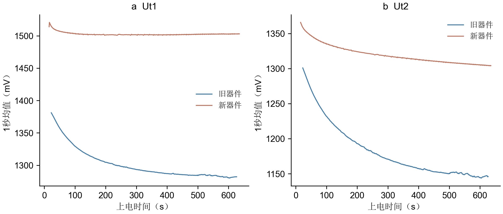
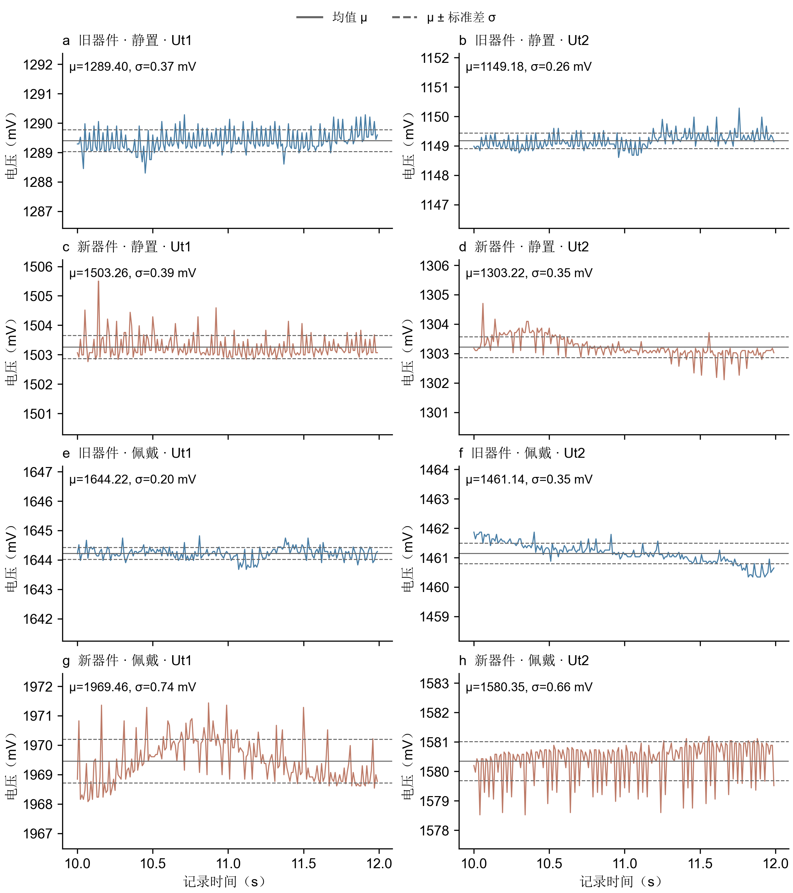
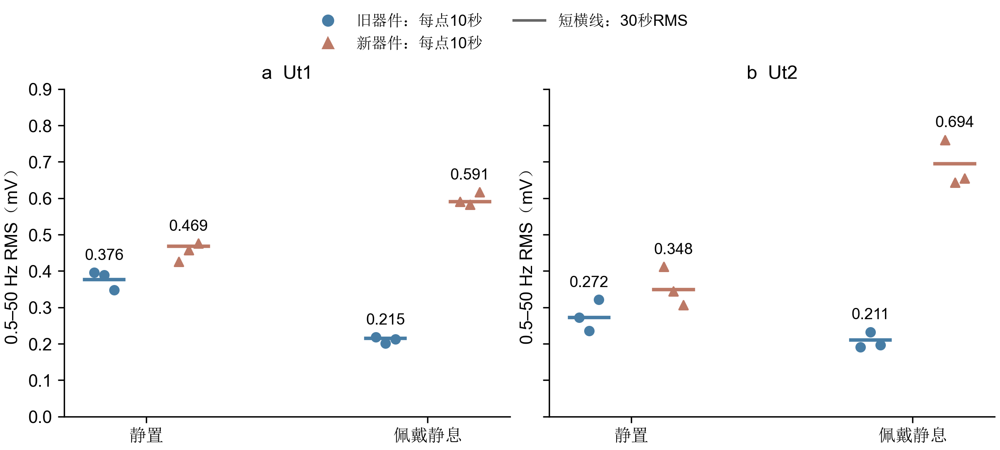
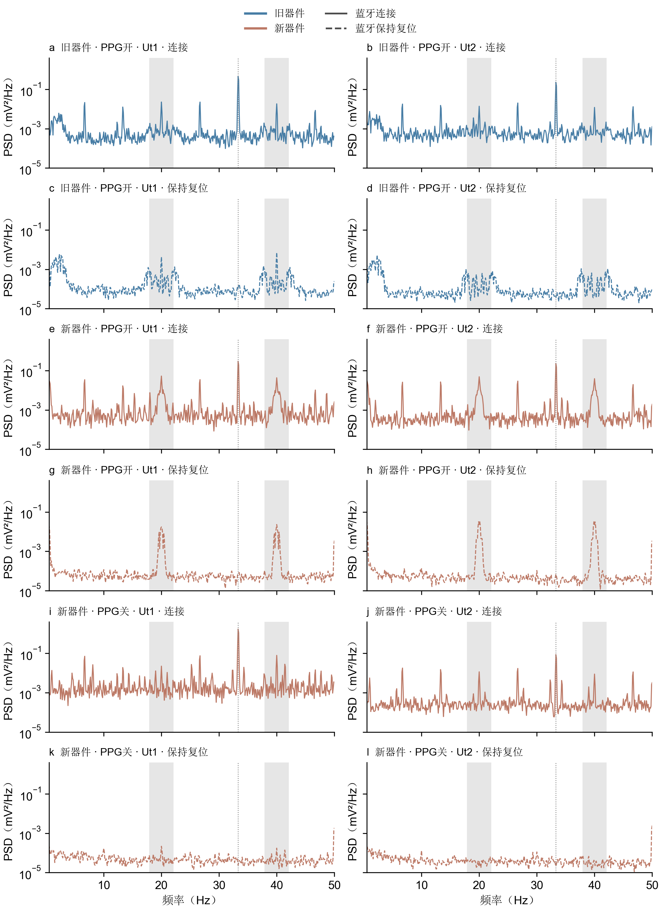
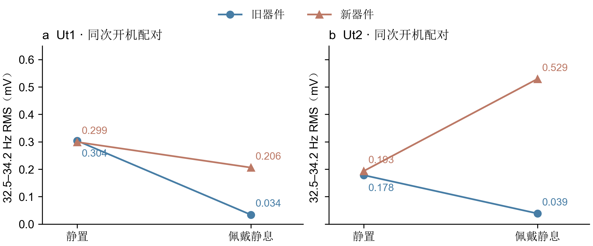
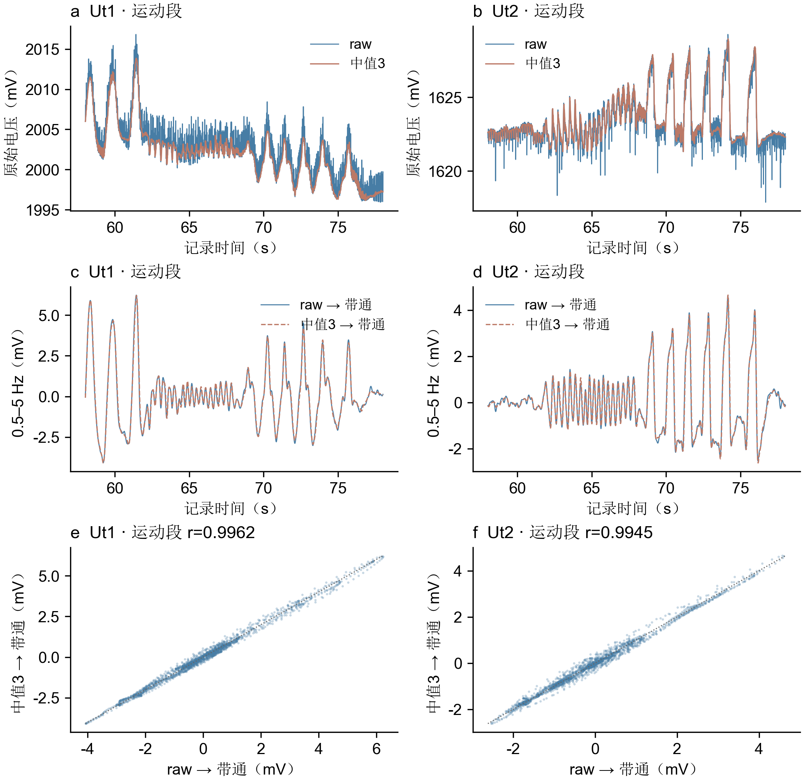

# 新制腕表性能与热膜噪声分析

2026年9月15日 · 组会报告

## 核心结论

- **开机下降趋势更早放缓，Ut1最明确。** 相同判据下，新器件约99秒、旧器件约336秒；不代表两路均已完全稳定。
- **新器件佩戴后的噪声更突出。** 完整工作状态下，两路0.5–50 Hz RMS约为旧器件的2.74、3.30倍。
- **蓝牙模块活动和PPG相关活动均有干扰证据。** 模块复位明显抑制33 Hz等谱线；关闭PPG/IIC后，复位状态下的20/40 Hz残余峰也接近消失。
- **三点中值可作为过渡方案。** 运动段两条处理路径经0.5–5 Hz带通后，相关系数为0.9962、0.9945，RMS幅值变化约1%以内；微弱响应是否受损仍需验证。

## 1. 开机表现：新器件较早放缓

**图1｜开机电压趋势。** 绘制原始电压的1秒均值；蓝色为旧器件，陶土色为新器件。新器件采用改善防风后的补录数据。横轴为MCU上电时间。

| 指标 | 新器件 | 旧器件 |
|---|---:|---:|
| Ut1：下降趋势持续放缓 | 99秒（1.7分钟） | 336秒（5.6分钟） |
| Ut1：达到更严格的趋平判据 | 172秒（2.9分钟） | 记录内未满足 |
| Ut2：下降趋势持续放缓 | 228秒（3.8分钟） | 记录内未满足 |
| 末60秒斜率，Ut1 / Ut2 | +0.16 / −1.92 mV/min | −1.01 / −0.31 mV/min |

“放缓”定义为60秒窗斜率绝对值小于5 mV/min，并连续120个滚动窗满足；更严格判据为1 mV/min。时间为首个合格窗的结束时刻，需要后续约2分钟确认。

**新器件Ut1更早趋平，但Ut2末尾仍有缓慢下降。** 因此本次只能说开机趋势较早放缓，不能给出两通道统一的稳定时间，也不能据此判断噪声更低。

## 2. 实验设计：分开比较四类变量

本轮区分**器件新旧、蓝牙状态、PPG状态、静置或佩戴**，通过逐步改变工作状态定位干扰。

| 实验 | 条件 | 回答的问题 |
|---|---|---|
| 完整工作对照 | 新旧器件；蓝牙、PPG全开；静置/佩戴静息；纯电池无线记录 | 实际使用中的噪声差距有多大？ |
| 蓝牙三轮复位 | 新旧器件；PPG开启；未佩戴；电池加USB、有线记录 | 哪些谱线与模块活动有关？ |
| PPG关闭对照 | 新器件；关闭PPG/IIC，再做三轮复位；其余条件相同 | 20/40 Hz残余是否与PPG有关？ |
| 运动响应验证 | 新器件正常佩戴采集，腕部运动 | 中值滤波是否保留响应？ |

噪声统一用**0.5–50 Hz RMS（mV）**，排除0–0.5 Hz慢基线。普通记录取前30秒；复位实验取每阶段中间20秒，三轮平均功率后开方。佩戴与运动的带内变化可能包含真实响应，不能全部视为电子噪声。**纯电池与USB接入的结果分开解释。**

## 3. 完整工作状态：佩戴后的差距更大

### 3.1 原始波形

**图2｜静置与佩戴静息的原始电压。** 固定取各记录10–12秒，不平滑、不去趋势；实线为均值，虚线为均值±标准差。子图保持相同电压跨度，纵轴为绝对mV。

新器件佩戴Ut2有明显周期负脉冲，Ut1还叠加慢变化。改善静置和防风后，快速周期扰动仍然存在。

### 3.2 RMS对比

**图3｜0.5–50 Hz RMS。** 每点为连续10秒窗，短横线为完整30秒RMS；散点反映同一记录内的时间变化，不是独立器件重复。

| 状态 | 通道 | 旧器件（mV） | 新器件（mV） | 新 / 旧 |
|---|---|---:|---:|---:|
| 静置 | Ut1 | 0.376 | 0.469 | 1.25倍 |
| 静置 | Ut2 | 0.272 | 0.348 | 1.28倍 |
| 佩戴静息 | Ut1 | 0.215 | 0.591 | 2.74倍 |
| 佩戴静息 | Ut2 | 0.211 | 0.694 | 3.30倍 |

静置采用新器件补录数据，与佩戴段不是同次开机。若改用同次开机的原静置记录，新器件佩戴前后为0.505/0.395→0.591/0.694 mV，分别增加17%/76%；旧器件则下降43%/23%。

**新器件未复现旧器件佩戴后的双通道改善。** 静置差距还随时间变化，例如新器件Ut1前30秒0.469、末30秒0.721 mV，不能用单一倍数代表整机固定噪声水平。

## 4. 噪声来源：蓝牙与PPG的干预证据

**图4｜三种配置下的蓝牙连接/复位频谱。** 颜色统一区分器件：蓝色为旧器件，陶土色为新器件；实线表示蓝牙连接，虚线表示保持复位。从上到下分三组：旧器件、PPG开；新器件、PPG开；新器件、PPG关。每组上排为连接、下排为保持复位，两条曲线分开显示，避免重叠。左列Ut1、右列Ut2。灰带标出18–22与38–42 Hz，灰色点线定位33.3 Hz。所有子图同一坐标范围，曲线为三轮平均PSD。

### 4.1 模块复位抑制33 Hz等周期分量

同组上下排比较可见：模块保持复位后，33.3 Hz以及6.7、13.3、26.7、46.7 Hz等谱线明显减弱。PPG开启时，两器件33.3±0.4 Hz带功率均下降约99.9%。

**这支持蓝牙模块活动是重要干扰来源。** 但复位同时改变射频、数字活动和耗电，尚不能只归因为射频辐射。新器件复位后仍保留20/40 Hz峰，解释了为什么去掉33 Hz后总RMS仍不够低。

### 4.2 关闭PPG/IIC后，20/40 Hz残余大幅减弱

比较第二、三组下排的陶土色虚线（新器件、蓝牙保持复位）：PPG/IIC关闭后，20/40 Hz邻域功率下降约98–99%，突出窄峰降至接近背景；总RMS由0.165/0.198降至0.053/0.050 mV，分别下降68%/75%。三轮方向一致，改取中间10秒仍成立。

**PPG相关活动是残余扰动最有解释力的来源，但内部采样与IIC读取尚未分开验证。** 零PPG输出和FIFO读样计数不增长支持停止读取，不能替代芯片内部状态或电流测量。

同时，蓝牙连接时关闭PPG，Ut1的33 Hz邻域反而增强，总RMS由0.378升至0.674 mV。两次记录的比较提示明显状态依赖，不能将蓝牙和PPG视为两项固定、可直接相减的噪声。

### 4.3 关键状态汇总

下表均为0.5–50 Hz RMS（mV）；普通记录为前30秒，USB实验为三轮平均功率开方。

| 条件 | 器件 | 蓝牙 / PPG | Ut1 | Ut2 |
|---|---|---|---:|---:|
| 纯电池，静置 | 旧 | 开 / 开 | 0.376 | 0.272 |
| 纯电池，静置（补录） | 新 | 开 / 开 | 0.469 | 0.348 |
| 纯电池，佩戴 | 旧 | 开 / 开 | 0.215 | 0.211 |
| 纯电池，佩戴 | 新 | 开 / 开 | 0.591 | 0.694 |
| USB，未佩戴 | 旧 | 连接 / 开 | 0.356 | 0.301 |
| USB，未佩戴 | 旧 | 复位 / 开 | 0.124 | 0.105 |
| USB，未佩戴 | 新 | 连接 / 开 | 0.378 | 0.344 |
| USB，未佩戴 | 新 | 复位 / 开 | 0.165 | 0.198 |
| USB，未佩戴 | 新 | 连接 / 关 | 0.674 | 0.210 |
| USB，未佩戴 | 新 | 复位 / 关 | 0.053 | 0.050 |

## 5. 旧器件为什么此前可用：佩戴后33 Hz干扰明显减弱

**图5｜同次开机的静置→佩戴对照。** 均取前30秒，指标为32.5–34.2 Hz带RMS。新器件使用与佩戴配对的第一次静置记录。

| 器件 | Ut1：静置→佩戴 | Ut2：静置→佩戴 |
|---|---:|---:|
| 旧 | 0.304→0.034 mV，下降89% | 0.178→0.039 mV，下降78% |
| 新 | 0.299→0.206 mV，下降31% | 0.193→0.529 mV，增加174% |

**旧器件佩戴后，两路33 Hz邻域干扰和宽带RMS均下降，这有助于解释此前实际使用中未暴露出同等严重的问题。** 新器件没有复现双通道改善，尤其Ut2反而增强，说明人体接触与器件之间的耦合仍是关键缺口。

佩戴同时改变温度、接触压力、姿态等因素，现有实验不能证明皮肤接触直接抑制蓝牙干扰，也不能确定供电、地或参考的具体耦合路径。

## 6. 折中方案：三点中值保留了本次运动响应的主要形态

### 6.1 同一运动段比较两条路径

**raw → 0.5–5 Hz带通**，与 **raw → 三点中值 → 同一带通** 比较。选用58.02–78.02秒运动段，由陀螺仪运动强度选定，不按最高相关性挑段。

**图6｜所有子图均对应同一20秒运动段。** 上排为原始mV信号与中值信号；中排为两条带通波形；下排为带通结果逐样本散点，虚线为相等线。蓝色raw路径、陶土色中值路径，保留实际时间戳，不补偿中值窗口的10 ms时序偏移。

| 通道 | 带通波形相关系数 r | 中值路径 / raw路径的带通RMS | 两路径RMSE |
|---|---:|---:|---:|
| Ut1 | 0.9962 | 0.9899 | 0.159 mV |
| Ut2 | 0.9945 | 0.9947 | 0.136 mV |

**相关性接近1，RMS幅值变化分别约−1.01%、−0.53%，支持本次较强运动响应基本保留。** 固定补偿10 ms后，运动段相关性分别为0.9983、0.9983。高相关性不等于完全无失真；逐点误差仍存在。

### 6.2 降噪效果与适用边界

同一记录的低运动片段19.02–29.02秒，三点中值使0.5–50 Hz RMS由0.947/0.380降至0.231/0.195 mV，下降约76%/49%。结合图中尖峰减少，支持其抑制本次快速扰动的作用。

**该方案适合作为暂时无法改善原始采集端时的过渡措施，不能替代根因修复。** 弱响应片段仍有差异；缺少无噪声参考，不能保证微弱信号或峰值细节不受影响。后续应保留raw，并以实际分析任务验证收益。

## 7. 下一步：验证可复现性，补齐耦合机制

1. **制作第二台新器件。** 重复静置/佩戴、蓝牙复位、PPG开关与运动实验，区分设计共性与单台焊接、装配等偶然因素。
2. **补做可逆佩戴对照。** 在一致供电和姿态下做未佩戴→佩戴→未佩戴，并分别切换蓝牙状态，观察33 Hz变化是否随人体接触重复出现。
3. **分离PPG内部采样与IIC。** 蓝牙保持复位，分别测试仅停止读取与确认芯片shutdown，必要时同步测供电/参考扰动。

**总结：新器件开机趋势较早放缓，但佩戴噪声更突出；蓝牙和PPG相关干扰已有证据，人体耦合路径仍待解释。三点中值能缓解尖峰并保留本次主要运动响应，可作为继续采集和验证期间的折中方案。**

---

### 方法与数据核验

噪声PSD：100 Hz采样，10秒Hann窗、50%重叠、逐窗去线性趋势；频带积分包含50 Hz奈奎斯特点。运动带通：Butterworth四阶原型（带通后八阶），SOS双向离线滤波，先处理完整有效序列再截取运动段；这不是实时滤波延迟验证。三点中值为尾随窗口，首两点无效。

新增记录85.54秒、8554样本，未发现丢帧、插补或相关错误计数增长，保存的四路中值均与重算一致。两器件各一台，三轮属于同台时间重复，不作批量器件推断。指标、敏感性结果与可复现脚本保存在报告同目录。
