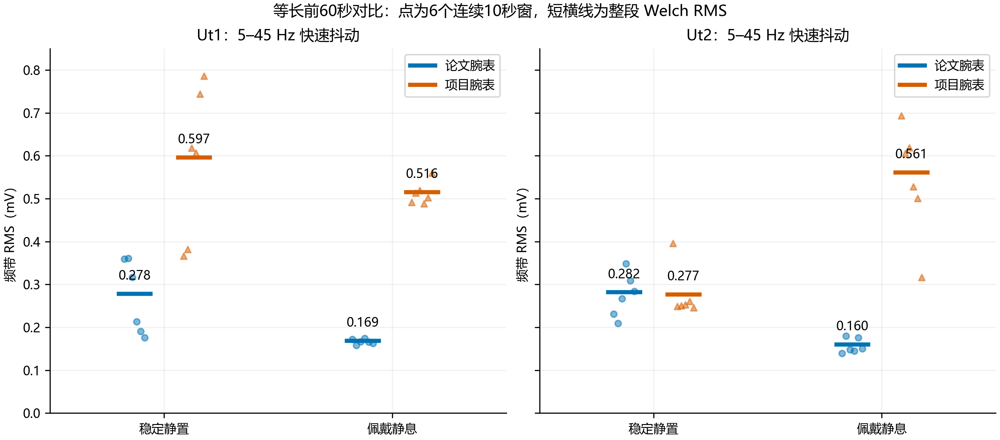
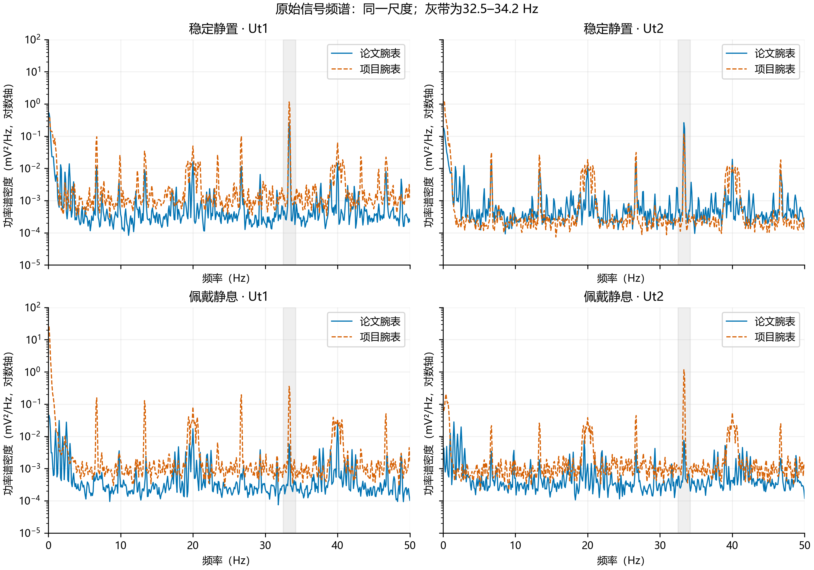
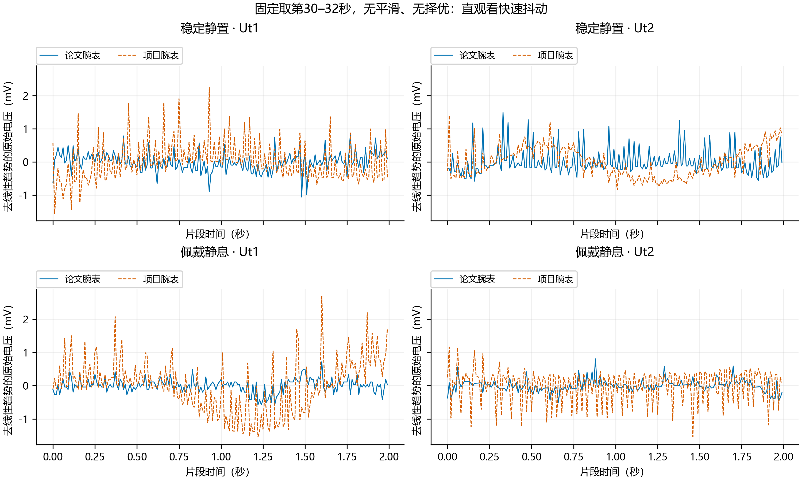
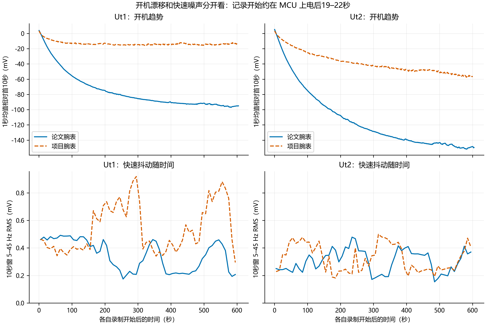
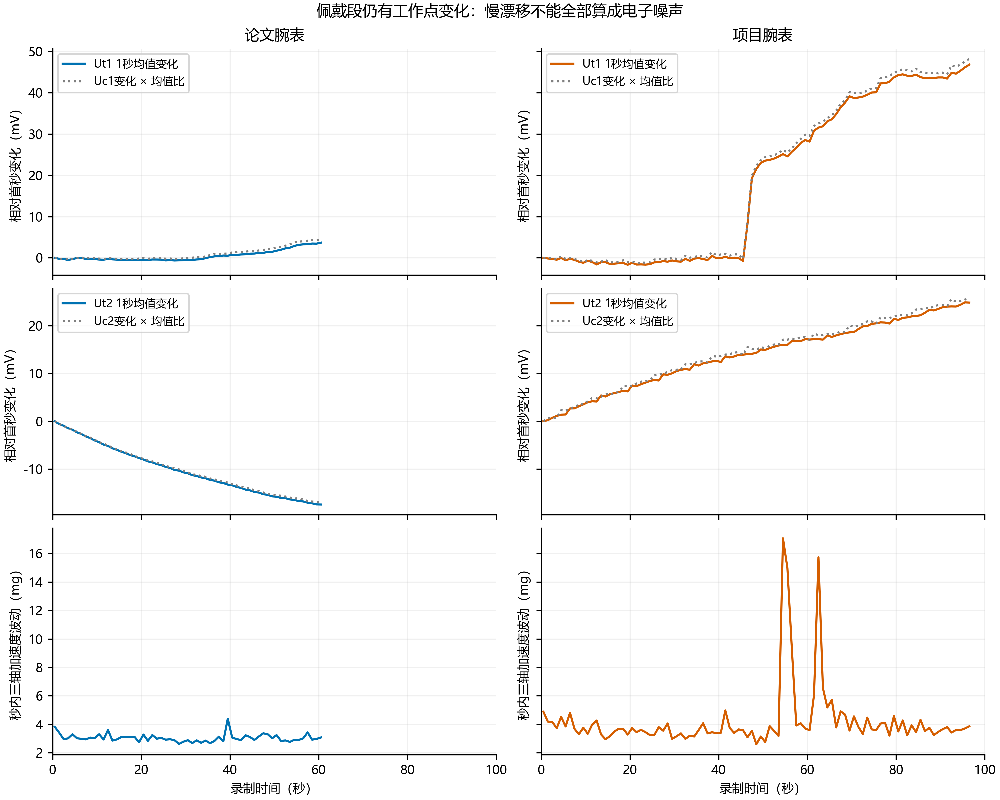

# 论文腕表与项目腕表：热膜噪声现状分析

分析日期：2026-09-15。范围：**仅今天新采集的六份 `kaiji1_LYX_0915.csv`**，不混入 0914 记录，也不混入蓝牙复位实验。

## 1. 结论先行

**项目腕表的噪声问题得到部分、且有通道和状态区别的证实：稳定静置时主要是 Ut1 额外噪声，佩戴后则两路均明显高于论文腕表。与此同时，慢漂移、接触/热状态变化与快速周期性干扰并存，不能合并成一个“热膜噪声大”的原因。**

1. **稳定静置：Ut1 快速抖动约为参考的 2.14 倍；Ut2 整体接近。** 因此不能说项目腕表两路在静置下都同等变差。
2. **佩戴：Ut1、Ut2 快速抖动分别约为参考的 3.05、3.50 倍。** 论文腕表佩戴后更安静；项目腕表 Ut2 反而增大，Ut1 则没有稳健的一致改善。
3. **两表都有约 33.3 Hz 及相关窄带谱峰。** 这不是项目腕表独有的指纹；项目腕表的幅度、其他频段残余及状态依赖更值得关注。
4. **长时间开机并未使快速噪声持续下降。** 论文腕表开机均值漂移反而更大；“热漂移大小”和“快速噪声大小”是两件事。
5. **项目腕表佩戴约第46–47秒出现 Ut1/Uc1 同步上跳。** 这是一项独立异常/状态转换，后段不能当严格平稳的电子噪声样本。

这里的“参考”是本次论文腕表实测值。它此前经过可用性检验，但本次没有绝对合格阈值、传感器标定或无噪声真值，因此不作新的合格/不合格判定。

## 2. 实验条件与数据可靠性

已由实验者确认：两表硬件一致；均电池供电、没有接 USB；均通过 HJ-380 蓝牙接收；佩戴前静置并尽量防风。每表从开机长记录到稳定静置再到佩戴记录，期间没有关机或复位。两表在同一手腕先后佩戴，先论文腕表、后项目腕表。

| 腕表 | 阶段 | 记录长度 | 首个至末个状态包 MCU 时间 |
|---|---|---:|---:|
| 论文 | 开机长记录 | 605.85 s | 22.115–627.115 s |
| 论文 | 稳定静置 | 64.75 s | 728.115–792.115 s |
| 论文 | 佩戴静息 | 61.11 s | 880.115–941.115 s |
| 项目 | 开机长记录 | 601.91 s | 19.115–620.115 s |
| 项目 | 稳定静置 | 104.11 s | 636.115–739.115 s |
| 项目 | 佩戴静息 | 97.20 s | 833.115–929.115 s |

“开机长记录”并非上电瞬间开始，最早十几秒没有覆盖。MCU 时间来自状态包，不等于精确的戴上时刻；三段之间有未录制间隔，不能跨间隔拼接做 FFT。两个 MCU 的时间各自从本机启动计数，不是两表同步时钟。

六份记录均通过以下检查：100 Hz 样本索引连续、序号含回绕连续；没有无效/插补行、重复索引或缺失索引；Time 与 SampleIndex/100 一致；状态包中发送忙、发送错误、ADC 错误、IMU 错误、PC 缺帧和无效候选包计数均无增长。**这支持本次差异不是由缺帧/插补造成；不证明模拟电路不存在异常。** 原始文件未改动，逐文件路径和 SHA-256 见 `inventory.csv`。

每类只有一台器件、一次本日记录；10秒窗是同一记录内的时间片，不是独立器件重复，不做显著性检验或总体推断。两表佩戴顺序不同，接触压力、皮肤温度、精确位置和等待时间未被量化控制；固件二进制及蓝牙实际参数也没有随 CSV 认证。

## 3. 指标怎么理解

本报告主分析 **Ut1、Ut2 原始桥顶电压**，完全不用 `Median3` 列代替原始数据。

| 指标 | 直观含义 | 使用边界 |
|---|---|---|
| 5–45 Hz 频带 RMS，mV | 每秒快速抖动的等效幅度；越小越安静 | 作为快速噪声代理，不是全部噪声或总精度 |
| 0.5–5 Hz 频带 RMS，mV | 较慢的波动；可能进入实际信号处理频段 | 佩戴时混合真实热/生理响应、微动和干扰 |
| 0.1–0.5 Hz RMS / 均值趋势 | 更慢的起伏、热机或接触漂移 | 不能全部视为随机电子噪声 |
| 32.5–34.2 Hz 功率占比 | 快速抖动中有多少集中在33 Hz附近 | 功率占比不是幅度占比，也不等于蓝牙因果占比 |
| 去线性趋势标准差、95%跨度 | 去掉整体斜坡后的总体波动和大部分值的跨度 | 仍可能包含非线性漂移及阶跃，不是纯噪声底 |

**RMS 翻倍表示抖动幅度约翻倍，功率约变成四倍。** 不把直流均值当有用信号来计算“信噪比”。相对均值的 ppm 仅作归一化辅助，不能代替热膜灵敏度标定。

为公平比较，主结果固定取各段**前60秒**，并检查前30秒、30–60秒、末60秒和全段。频谱采用 Welch：100 Hz、1000点周期 Hann 窗、50%重叠、每窗去线性趋势、单边 PSD，频率间隔0.1 Hz；频带功率按频点 PSD×频率间隔求和，开方得到 RMS。60秒主段包含11个重叠频谱窗。方法与单位依据 [SciPy Welch 文档](https://docs.scipy.org/doc/scipy/reference/generated/scipy.signal.welch.html)。

各频带用下界含、上界不含的频点规则。45–50 Hz另列于指标文件，避免奈奎斯特边缘主导主指标；用512点窗复核，四组静置/佩戴主结果的变化均小于2%，结论不依赖1000点窗。未作陷波、未作离群点删除或择优取“最安静”片段。

Uc1/Uc2 在100 Hz记录里有约91–92%的相邻重复值，符合项目约10 Hz更新后保持的行为；这里只作10点平均后的低频工作点辅助分析，**不把它们当成100 Hz独立采样来评定高频噪声**。完整四路指标在 `metrics.csv`，Uc低频数值是这一处理下的描述量。

## 4. 稳定静置与佩戴：主要对比

### 4.1 快速抖动

| 状态 | 通道 | 论文腕表 RMS（mV） | 项目腕表 RMS（mV） | 项目 / 论文 |
|---|---|---:|---:|---:|
| 稳定静置 | Ut1 | 0.278 | 0.597 | **2.14×** |
| 稳定静置 | Ut2 | 0.282 | 0.277 | **0.98×** |
| 佩戴静息 | Ut1 | 0.169 | 0.516 | **3.05×** |
| 佩戴静息 | Ut2 | 0.160 | 0.561 | **3.50×** |

每个点是一个连续10秒窗，共6个；短横线为整段前60秒的 Welch RMS。点的散布体现时间变化，不是独立重复的置信区间。

**各自佩戴前后：**

- 论文 Ut1：0.278→0.169 mV，下降39%；Ut2：0.282→0.160 mV，下降43%。不同取段均支持下降。
- 项目 Ut1：前60秒汇总为0.597→0.516 mV，下降14%；但前30秒是0.454→0.506 mV，反而上升12%。所以更稳妥的判断是：**仍处于较高抖动水平，未见一致的佩戴改善**。
- 项目 Ut2：0.277→0.561 mV，约翻倍；各取段均支持佩戴后增大。

按各自直流均值归一化，Ut1 静置的项目/论文比仍为1.86倍；佩戴 Ut1/Ut2 分别为2.54/3.21倍。项目腕表更高的直流工作点能解释一部分“绝对mV更大”的观感，但不能解释全部差异。

### 4.2 取段敏感性

| 比较片段 | 静置 Ut1 项目/论文 | 静置 Ut2 | 佩戴 Ut1 | 佩戴 Ut2 |
|---|---:|---:|---:|---:|
| 前30秒 | 1.30× | 1.29× | 2.97× | 4.03× |
| 前60秒，主结果 | 2.14× | 0.98× | 3.05× | 3.50× |
| 30–60秒 | 3.70× | 0.81× | 3.10× | 2.85× |
| 各自末60秒 | 2.88× | 0.92× | 3.84× | 2.44× |

静置 Ut1 与佩戴两路的方向一致，但倍数会随时段变化。静置 Ut2 有时略高、有时略低，不能下“项目 Ut2 静置一定更差”的结论。末60秒是各自记录的末尾，并非相同佩戴时长，属于敏感性检查。

### 4.3 较低频段也不能忽视

| 状态 | 通道 | 论文 0.5–5 Hz RMS（mV） | 项目 0.5–5 Hz RMS（mV） |
|---|---|---:|---:|
| 稳定静置 | Ut1 | 0.135 | 0.246 |
| 稳定静置 | Ut2 | 0.137 | 0.257 |
| 佩戴静息 | Ut1 | 0.127 | 0.328 |
| 佩戴静息 | Ut2 | 0.121 | 0.219 |

项目腕表静置时两路在这个频段都约为参考的1.8–1.9倍。所以，**Ut2 的高频总量接近，不等于它所有频段都接近**。佩戴段低频增大不能直接当作传感器损坏，尤其 Ut1 包含后述阶跃。只取阶跃之前的前30秒，项目佩戴 Ut1/Ut2 的该频带 RMS 仍为0.275/0.225 mV，论文为0.124/0.126 mV，说明差异不全由这一次阶跃造成。

## 5. 频谱：有共同周期性干扰，也有额外残余

各子图使用同一对数纵轴。33.3 Hz最突出，另见约6.7、13.3、20、26.7、40、46.7 Hz等谱峰，其中不同条件的强度不同。这种成组窄峰和时域的周期尖脉冲支持存在**周期性系统活动/耦合**，不像单一平滑热漂移或纯宽带随机噪声。

| 状态 | 通道 | 论文33 Hz带功率占比 | 项目33 Hz带功率占比 |
|---|---|---:|---:|
| 稳定静置 | Ut1 | 60.4% | 57.2% |
| 稳定静置 | Ut2 | 58.4% | 27.4% |
| 佩戴静息 | Ut1 | 4.9% | 24.3% |
| 佩戴静息 | Ut2 | 7.6% | 64.7% |

**论文腕表佩戴后，33 Hz带明显减弱；项目腕表 Ut2 佩戴后更被33 Hz带主导。** 注意：占比必须结合总RMS。项目静置 Ut2 的占比更低，不能据此说整体更安静。

从频谱功率中排除32.5–34.2 Hz后，其余5–45 Hz RMS为：

- 静置 Ut1：论文0.175、项目0.390 mV，仍相差2.23倍。
- 佩戴 Ut1：论文0.165、项目0.449 mV；Ut2：论文0.154、项目0.333 mV。

进一步排除6.67 Hz整数倍附近各±0.4 Hz的主要梳状谱带，静置 Ut1 剩余 RMS仍是0.138 vs 0.280 mV；佩戴 Ut1为0.136 vs 0.271，Ut2为0.144 vs 0.241 mV。**项目腕表差异并不局限于单一33 Hz窄带。** 这些剩余值仍可能含其他谱线及真实变化，不称作已隔离的“纯白噪声底”；这也是频域分账，不是声称实施了无损滤波。

这两秒固定取自每份记录的30–32秒，仅去掉线性趋势，没有平滑。项目佩戴 Ut2 的周期负向脉冲尤其清楚。

33.3 Hz 是100 Hz输出中看到的频率，**不是2.4 GHz射频本身，也不能据它唯一推定蓝牙连接间隔**。采样混叠、数字调度、供电负载脉冲均可能产生低频谱线；需要控制实验才能锁定源头。[ADI 数据采集信号链说明](https://www.analog.com/en/resources/analog-dialogue/articles/ac-and-dc-data-acquisition-signal-chains-made-easy.html)讨论了采样混叠与模拟滤波的边界。

## 6. 开机过程：漂移更大不等于噪声更大

上排是1秒均值相对首10秒均值的变化，下排是连续10秒窗快速RMS。

| 腕表 | 通道 | 末10秒均值 − 首10秒均值 | 首60秒快速 RMS | 末60秒快速 RMS |
|---|---|---:|---:|---:|
| 论文 | Ut1 | −95.2 mV | 0.468 mV | 0.303 mV |
| 论文 | Ut2 | −149.2 mV | 0.244 mV | 0.342 mV |
| 项目 | Ut1 | −13.6 mV | 0.418 mV | 0.699 mV |
| 项目 | Ut2 | −56.5 mV | 0.355 mV | 0.369 mV |

论文腕表的开机下降趋势更明显；项目 Ut1 的均值较早变平，但快速噪声仍出现两段大幅增强。项目 Ut2 在约10分钟后仍有下降趋势，末60秒线性斜率约−3.07 mV/min；论文末60秒约为Ut1 −0.90、Ut2 −0.20 mV/min。

因此，开机约10分钟后的“稳定”应理解为实验操作阶段名称，不能保证四路都达到同一热平衡标准。**继续等开机，不保证周期噪声消失；快速噪声有非单调、随时间变化的幅度。** 异步周期活动的相位/拍频、工作点和环境变化都值得检查，但本数据不能判定是哪一个。

## 7. 佩戴过程：高频噪声之外还有工作点转换

上两排是Ut的1秒均值变化；灰虚线把对应Uc变化乘以本段Ut/Uc均值比，仅用于比较趋势，**不是噪声扣除或标定**。下排为每秒内三轴加速度的去均值合成波动。

- 佩戴后电压工作点较桌面明显升高：前60秒 Ut1，论文约1288→1645 mV，项目约1483→1975 mV。这说明两种工况的工作点并不相同。
- 整段末10秒相对首10秒：论文 Ut1约+3.2 mV、Ut2约−14.7 mV；项目 Ut1约+45.1 mV、Ut2约+22.3 mV。整段长度不同，这组数用于描述过程，不作为等长噪声排名。
- 项目 Ut1约46–47秒出现明显上跳，最大相邻1秒均值增量约11.1 mV；Uc1同时变化。之后仍持续上升。Ut1/Uc1在前60秒的1秒均值相关系数约0.9998；共同桥路/工作点变化是合理解释方向，不能单凭相关性证明是热响应。
- 较明显的加速度波动在项目佩戴约55秒、63秒附近；与Ut1最早上跳并非精确同步。不能把第46秒阶跃直接定为手腕运动，也不能因IMU没有同步大峰就排除局部接触或表带压力变化。

用户的操作是“手腕静置”，与存在微小运动并不矛盾。戴上后的热交换、局部压力与电路状态均可能变化。**需要单独记录戴上时刻/触碰事件，才能把热适应、机械作用和异常电子瞬态进一步分开。**

## 8. 原因解释：按证据强弱排序

### 有直接数据支持

- Ut1静置额外快速扰动、佩戴两路差距、33 Hz成组谱峰、非单调噪声幅度及佩戴阶跃均可由本次记录直接看到。
- 数据链路完整，未发现数字传输丢样造成噪声的证据。
- 两表硬件设计相同、均电池供电；USB接入差异不是本次组间解释。

### 值得优先验证，但尚未确认

1. **蓝牙/数字周期活动通过供电、参考、地或电磁途径耦合进模拟链路。** 共同梳状谱峰符合周期源特征；此前项目材料中的蓝牙复位实验也提示模块活动相关，但那是另一批数据，本次没有RF开关对照，不能直接移用为本次因果结论。ADC固定杂散可能经供电、参考和信号输入路径进入，已有典型工程案例；这只支持排查方向，不证明当前板子的具体路径。[ADI 固定频率杂散排查](https://www.analog.com/en/resources/analog-dialogue/articles/analyzing-and-solving-fixed-frequency-spur-issues-in-high-precision-adc-signal-chains.html)
2. **通道和工作点决定了同一个干扰源耦合多少。** 项目Ut1桌面偏高、Ut2佩戴才明显变高，提示应关注各路阻抗、桥路运行点、局部布局/焊接/接触及供电抑制差异。设计一致不代表元件个体、装配和接触完全一致；目前不能指定某个器件损坏。
3. **佩戴改变热/接触边界，且项目Ut1出现额外状态转换。** 同步Uc变化与非平稳均值支持整条桥路状态发生变化；真实热响应、接触事件、供电/参考变化仍需分辨。

### 当前不能成立的结论

- “所有噪声都是蓝牙射频辐射导致。”复位会同时改变射频、数字活动与耗电，哪怕复位有效仍需区分路径。
- “论文腕表没有33 Hz，所以项目腕表才有问题。”本次论文桌面也有明显33 Hz。
- “仅做33 Hz陷波/中值即可恢复论文腕表水平。”谱带外仍有差异，而且滤波可能改变真实弱信号。
- “项目腕表热膜本体已损坏”或“整个装置不合格”。缺少热膜/电路交叉互换、标定与明确限值。

## 9. 后续最有区分力的三项验证

1. **先比较两表各自的模块复位三轮。** 固定供电、姿态、PPG与固件设置，在每台内部比较连接/保持复位的33 Hz带和剩余5–45 Hz RMS。若项目额外差距主要在复位时消失，优先查模块活动相关耦合；若复位后Ut1仍明显高，继续查独立模拟链路/传感器差异。新的USB有线接入条件要保持各段一致，不能与本次纯电池无线段直接相减归因。
2. **单独复现佩戴过渡及第46秒型阶跃。** 记录戴上时刻，随后不触碰；在另一次记录中给出有时间标记的轻触/松紧变化。共同检查Ut、Uc和IMU。不要把存在突变的整段当稳定噪声底。
3. **若差距残留，再做通道/器件交叉定位。** 在硬件允许、由实验者操作的条件下交换传感器与采集通道，判断噪声跟随传感器还是跟随电路通道；必要时测量BLE供电、ADC参考和模拟地的同步扰动。

这三项是下一轮实验建议，本次未操作硬件或更改采集固件。

## 10. 复现与交付

- `analyze.py`：完整分析、合成信号数值自检和绘图脚本；`python analyze.py --export` 重新生成全部结果。
- `inventory.csv`：六份输入、长度、质量检查和原始文件哈希。
- `metrics.csv`：四通道×五种取段的描述与频带指标；`blocks_10s.csv`：逐10秒时间变化。
- `diagnostics.csv`：漂移、谱带外残余及512点窗复核；`coupling.csv`：探索性通道相关/相干，不能作为因果证据。
- PNG及SVG：五组图；灰度预览、`figure-qa.json`：版式检查。`validation.json`：合成33.3 Hz和2 Hz正弦RMS校验、PSD功率归一化及输入连续性检查。

数值核验通过；图像已检查中文、单位、同轴尺度及遮挡。分析仅支持本次两台腕表和这些条件；没有把同一条记录的大量采样点当成大量独立实验。
