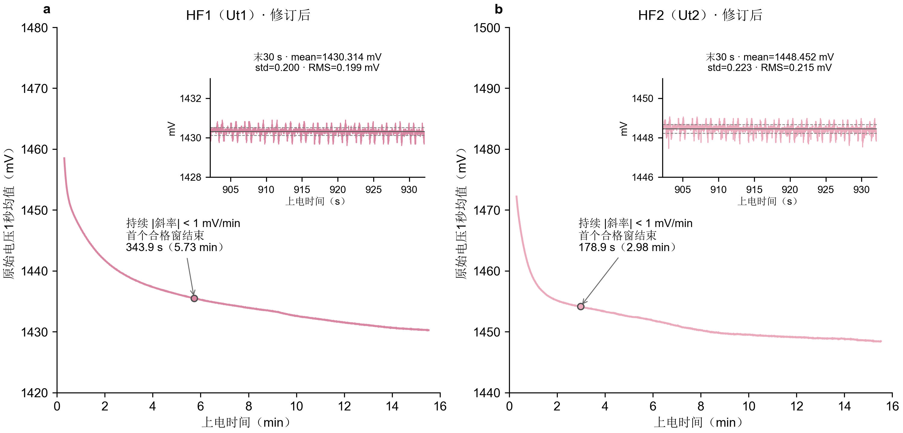
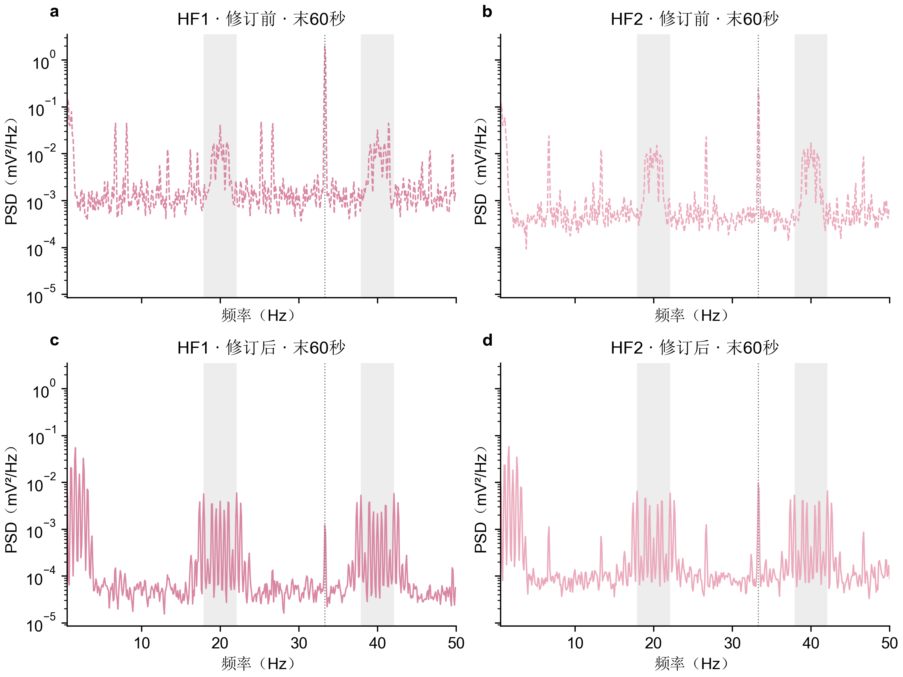

# 蓝牙电源电容提升至1 μF后的热膜信号评估

2026年9月22日｜同一新器件修订前后对照

## 核心结论

**更换电容后，无线静置条件下的热膜周期干扰明显减弱，支持这项硬件修改有效；但仍有残余周期波动，不能判定噪声已全部消除。**

- **后期噪声：**末60秒HF1、HF2的0.5–50 Hz RMS分别为 **0.197、0.215 mV**。与修订前无线静置记录的末60秒相比，下降 **74%、47%**；相同上电时间复核，仍下降 **74%、44%**。
- **蓝牙相关谱线：**末60秒33 Hz邻域功率相对修订前下降 **99.92%、95.69%**。HF1原先占主导的33.3 Hz峰大幅减弱，HF2仍可见较弱残余峰。
- **开机过程：**两路先快速下降、后逐渐放缓。按持续低于±1 mV/min的判据，HF1约上电 **5.7分钟**、HF2约 **3.0分钟**满足；末尾仍有约−0.24、−0.27 mV/min的慢漂移。

## 1. 实验改动与分析口径

用户确认，本次仍为同一台新器件，纯电池供电、PPG开启、未佩戴、防风静置，通过无线采集；主要改动是将蓝牙低压电源端电容由原先的小容值更换为 **1 μF**。原装实际为10 nF还是1 nF尚未确定，报告不据此计算精确容值倍率。

Renesas官方AN-B-075在Buck配置中给出：低压轨 **VBAT_LOW** 的输出滤波电容C2为 **1 μF有效容值**；并提示MLCC的有效容值会受直流偏压影响。这支持此次修改的硬件依据。用户电路中称该节点为VCC_LOW；具体引脚编号需对应封装或模块原理图，不将“1号脚”推广到所有DA14531封装。[官方硬件指南，§3.2.1.4及图13](https://www.renesas.com/en/document/apn/b-075-da14530531-hardware-guidelines)

本次数据包含 **91,428个样本、914.28秒（15分14秒）**。按STATUS和样本计数还原，覆盖MCU上电后约 **17.87–932.15秒**，因此没有记录最初约18秒。未发现序号中断、丢帧、插补或相关错误计数增长；PPG通道持续有数据，FIFO累计读样数增长91,685。

分析约定：

- **HF1对应Ut1，HF2对应Ut2。** 全部结果使用原始mV数据，没有使用中值滤波或平滑来证明硬件降噪。
- 开机图仅用1秒均值呈现慢趋势；噪声仍统一为 **0.5–50 Hz RMS**，由功率谱积分后开方，排除0–0.5 Hz缓变基线。
- 频谱主分析窗口固定为本次**末60秒**，即上电872.15–932.15秒；趋势图中的局部子图取**末30秒**，即902.15–932.15秒，没有挑选最低噪声片段。
- 历史对照使用9月15日改善防风后的新器件无线静置记录。另比较相同上电时间，降低热机时长不同的影响；USB接入的蓝牙复位数据不用于本次绝对RMS对照。

## 2. 开机趋势：逐渐趋平，但末尾仍有慢漂移

**图1｜开机趋势与后期噪声。** HF1使用`#d986a2`，HF2使用`#eba9bc`。主图为原始电压的1秒均值，两路纵轴均为60 mV跨度；圆点标出首次满足持续低于±1 mV/min判据的窗口结束时刻：HF1为343.9秒，HF2为178.9秒。右上子图展示末30秒未经滤波的原始信号，纵轴均为5 mV跨度，标注该窗口的mean、原始std及0.5–50 Hz RMS；灰实线为均值，灰虚线为均值±std。扩大坐标范围仅改变展示比例，数据和后文慢漂移指标未改变。

**两路都表现为先快后慢的下降，没有在记录末尾完全停止变化。** 为避免只凭肉眼判断，沿用此前的描述性规则：60秒滚动窗斜率绝对值低于阈值，并连续120个滚动窗满足。表中为首个合格窗的结束时间，需要后续约2分钟才能确认；本次满足后至记录结束也未再次越过对应阈值。

| 趋平判据 | HF1 | HF2 |
|---|---:|---:|
| 持续低于±5 mV/min：明显放缓 | 123秒，2.0分钟 | 109秒，1.8分钟 |
| 持续低于±1 mV/min：较平缓 | 344秒，5.7分钟 | 179秒，3.0分钟 |
| 持续低于±0.5 mV/min：更严格趋平 | 741秒，12.3分钟 | 545秒，9.1分钟 |
| 末60秒斜率 | −0.236 mV/min | −0.269 mV/min |

因此，**本次可将约上电12.3分钟之后作为两路均满足较严格趋平判据的阶段**，但仍应称为“后期较平稳”，而非完全热稳定。电容修订的主要收益是带内周期干扰降低，不能仅凭这次开机曲线认定热机时间也得到改善。

## 3. 后期原始波形：噪声量级降低，周期波动仍可辨认

图1的末30秒子图中，HF1的mean/std/RMS分别为 **1430.314/0.200/0.199 mV**，HF2为 **1448.452/0.223/0.215 mV**。子图以5 mV跨度呈现小幅波动，不将噪声铺满纵轴。为与频谱口径保持一致，下表继续列出末60秒统计。

| 末60秒指标 | HF1 | HF2 |
|---|---:|---:|
| 原始均值 | 1430.373 mV | 1448.521 mV |
| 原始标准差 | 0.208 mV | 0.231 mV |
| **0.5–50 Hz RMS** | **0.197 mV** | **0.215 mV** |
| 0.5–5 Hz频带RMS | 0.157 mV | 0.166 mV |

原始标准差包含慢漂移，因此略高于排除缓变后的频带RMS。局部图仍能看到有规律的起伏和快速波动，说明当前信号并非只剩随机背景噪声。

**这一水平不依赖某个特别安静的小窗。** 改用末30、60、120秒，HF1的RMS为0.199、0.197、0.196 mV，HF2为0.215、0.215、0.221 mV。全记录30个完整、不重叠的30秒窗中，HF1为0.161–0.197 mV，HF2为0.179–0.232 mV；剩余14.28秒未单独作为不足30秒的窗，已包含在末段分析中。带内噪声没有随基线下降同步降至零。

## 4. 频谱对照：33 Hz大幅减弱，20/40 Hz附近仍有残余

**图2｜同一新器件的修订前后频谱。** 上排为9月15日无线静置记录末60秒，下排为本次末60秒；左列HF1、右列HF2。HF1、HF2颜色与图1一致，虚线表示修订前，实线表示修订后。曲线分面展示，避免遮挡；所有面板使用相同的频率与PSD范围。灰带为18–22和38–42 Hz，灰色点线标出33.3 Hz。两次主窗口上电时间不同，同时间复核见下文。

### 4.1 最明确的改善是33 Hz干扰减弱

| 指标 | HF1：修订前→后 | HF2：修订前→后 |
|---|---:|---:|
| 0.5–50 Hz RMS | 0.748→0.197 mV | 0.403→0.215 mV |
| 总RMS幅度下降 | **73.7%** | **46.7%** |
| 32.5–34.2 Hz带RMS | 0.588→0.0168 mV | 0.208→0.0431 mV |
| 该带功率下降 | **99.92%** | **95.69%** |
| 18–22 Hz带功率下降 | 88.5% | 80.4% |
| 38–42 Hz带功率下降 | 91.6% | 81.4% |

注意区分**RMS幅度下降**与**功率下降**；后者按RMS的平方计算。改善不只出现在33 Hz，20/40 Hz邻域也减弱，但这些频带并未消失。

为检查是否只是本次等待更久造成的，进一步取两次共同覆盖的**上电681.035–741.035秒**：修订后HF1/HF2的RMS为0.195/0.225 mV，相对修订前下降 **73.9%/44.2%**，方向和量级与主比较一致。同时间的33 Hz带功率下降 **99.87%/86.78%**；HF2改善较主窗口小，表明残余蓝牙相关分量仍随时间变化。

另取两次开机记录都覆盖的上电540–600秒，总RMS下降约70%/54%，再次支持改善。历史噪声有时间依赖，因此不将某个下降百分比视为固定器件参数。

### 4.2 当前剩余噪声主要表现为低频起伏和周期谱线

本次末60秒，0.5–5 Hz占0.5–50 Hz总功率约 **63%（HF1）、59%（HF2）**，突出峰位约在1.0、1.6、2.1、2.6 Hz；20/40 Hz附近仍有一组窄峰，HF2也保留33.3 Hz峰。

这些结果表明：**原先占主导的蓝牙相关干扰受到抑制后，较小的其他周期成分更加显眼。** 此前PPG/IIC关闭实验支持PPG相关活动参与20/40 Hz扰动，但本次没有再次切换PPG，不能把修订后的全部残余直接归给PPG，也不能仅凭低频峰判断某个具体任务、热过程或混叠源。

## 5. 对硬件原因的判断与下一步

**“低压电源端电容不足是此前干扰的重要因素”获得了更强支持。** 依据是：官方电路要求与原先容值存在明显差距；用户确认主要只改动该电容；随后，在蓝牙和PPG均开启的无线采集中，相关谱线与总RMS均降低，同上电时间的对照也能复现。

但目前测到的是热膜电压，不是DA14531低压轨纹波。**“电容不足导致纹波增大，再经供电、地或参考耦合进入热膜测量”是合理解释，尚未直接测得完整链路。** 此次也未证明蓝牙数字电路此前失稳。后续若需要确认这一机制，可同步测量修订前后的低压轨和热膜/ADC参考扰动。

接下来最有价值的验证是：

1. **补录佩戴静息与运动。** 本次只验证未佩戴静置，尚不能认定之前的人体接触耦合问题也已解决。
2. **在修订后硬件上复做蓝牙复位和PPG开关。** 区分当前HF2的33 Hz残余与20/40 Hz附近成分。
3. **重复开机并复测第二台器件。** 当前只有同一台器件的一次修订后长记录，还不能评估跨次、跨器件一致性。

**结论：把电容提升至1 μF明显改善了本次新器件的无线静置热膜信号，尤其压低了33 Hz相关干扰；后期两路RMS约0.20–0.22 mV。下一阶段应关注残余周期波动与佩戴状态，而不是继续把全部噪声都视为未解决的蓝牙主干扰。**

---

## 方法与复现

PSD采用100 Hz采样、10秒Hann窗、50%重叠、逐窗线性去趋势，分辨率0.1 Hz；频带RMS为频点功率求和乘以频率间隔后开方，包含50 Hz奈奎斯特点。这与此前报告口径一致，不等于用理想高通滤波器彻底去除慢变泄漏。原始信号未做中值、低通或带通处理。

原始文件不修改。报告同目录提供`analyze.py`、`metrics.csv`、`blocks_30s.csv`、`settling.csv`、`spectra.csv`及`validation.json`（输入哈希、样本范围和错误计数）；图表同时输出PNG、SVG、PDF。颜色按两路信号区分：HF1为`#d986a2`、HF2为`#eba9bc`；中文宋体、英文和数字Arial。

本报告为一次硬件修订的实验验证，无独立器件重复统计和显著性检验；0.20–0.22 mV是本次观测水平，不作为通用噪声合格阈值。
