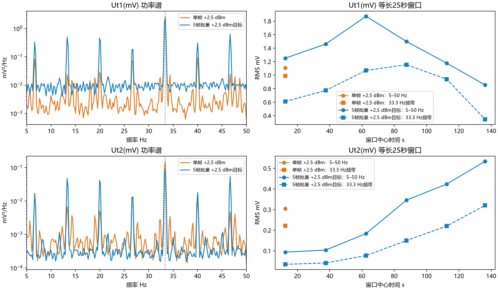
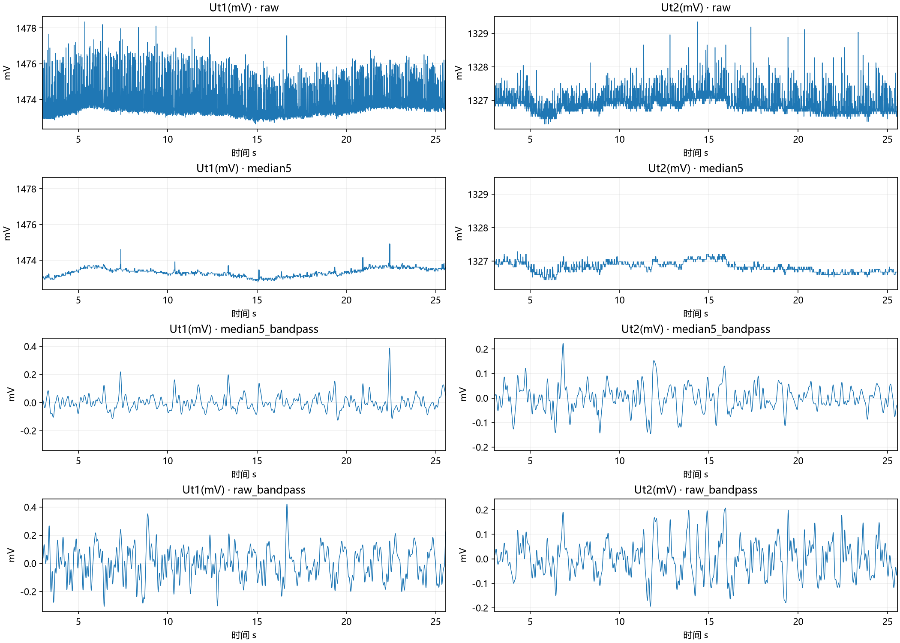
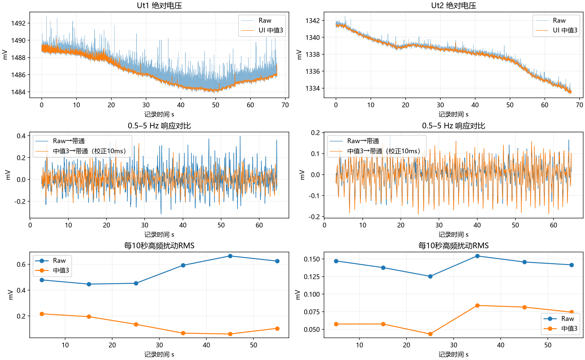
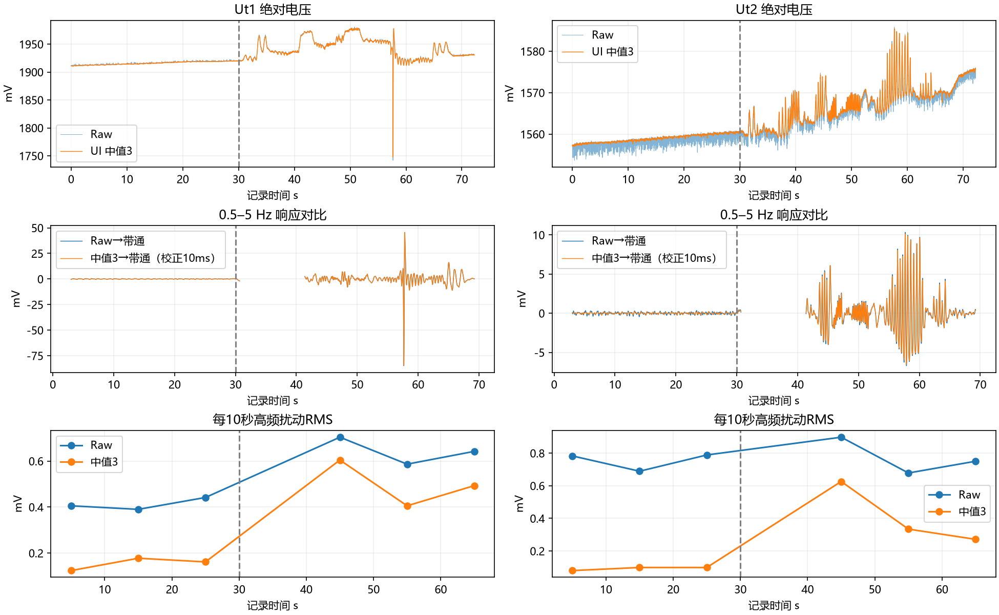

# 热膜与蓝牙实验总结及项目交付说明

实验日期：2026-09-13～14。平台：STM32L452CEU6、HJ-131IMH BLE模块、HJ-380 USB dongle、PyQt5上位机。

## 当前结论与交付选择

1. 热膜桥顶信号的约33.3 Hz周期扰动与蓝牙工作状态强相关；复位保持实验显著抑制该分量。但具体是供电、地/参考还是射频耦合，尚未确定。
2. 软件功率调整和批量发送未证明稳定的双通道源头降噪效果。最终保留 **+2.5 dBm目标、100 Hz单帧发送**；每次启动复位模块后写入功率，未读回验证。
3. UI默认四路热膜 **尾随3点中值**，端口旁“原始数据”按钮切换原始显示。CSV同时保留原始值、中值和有效标记。中值不作用于PPG/IMU。
4. 人体运动记录中，中值后带通与直接带通整体接近；尚不能据此保证弱小响应、快速峰值或绝对电压完全无损。原始数据始终保留。
5. 实验模式已从日常固件配置页撤下，历史控制器及脚本保留用于复现。未删除本地实验记录。

## 实验时间线与关键结果

### A. 初次无线/有线对照

数据：170610（无线28.55秒）和171236（有线24.96秒），日期均20260913。

现象补充：先电池供电连接蓝牙，再插USB时，有线与无线都吵；先插USB时HJ-380实际断连，有线安静。电池始终连接。故这不是保持板端状态一致的单纯接收链路对照。

初次分析用等长片段及边缘裁剪：Ut1的5–45 Hz RMS约1.104/0.0859 mV，Ut2约0.290/0.0654 mV，噪声差异显著。约33.3 Hz突出。两次姿态不同，不能把全部差异归结为传输方式。

### B. HJ-380连接/断开

194040：全程有线记录，约每30秒插拔dongle，三轮。断开后先变安静，稍后部分反弹。断开连接不等于模块射频关闭，可能继续广播等活动；因此继续做模块复位实验。

### C. 模块射频复位三轮

201756、202314：全程有线、dongle保持插入，正常连接30秒、保持复位30秒、释放重连后再计时，三轮。第一份前段防风不佳，主要采用第二份。

第二份每轮正常→复位的5–45 Hz RMS：

|通道|第1轮|第2轮|第3轮|
|---|---:|---:|---:|
|Ut1 mV|0.656→0.454|1.815→0.360|0.646→0.361|
|Ut2 mV|0.145→0.080|0.114→0.065|0.155→0.067|

33 Hz频带功率降幅Ut1约92.1%、99.8%、93.4%；Ut2约96.2%、96.4%、98.6%。仍有高端频带及稀疏毛刺残留，不能说全部噪声来自蓝牙。

### D. 发射功率：读回受阻与只写实验

211420/211637等尝试因读回超时失败，不代表配置命令一定没发出。213436自检未插dongle；214306补测连接状态后仍无可靠读回。历史接线文档提示MCU UART RX存在USB-TTL与BLE TX并接可能性，尚未独立验证当前硬件连线。

用户同意只写控制。215626有线、215623无线：目标档位+2.5/0/+2.5/−5/+2.5/−10/+2.5 dBm，每档稳定10秒、测量60秒。共同69983个样本的传感器值一致；记录中无缺帧/链路错误。

低功率目标相对相邻+2.5参考的5–50 Hz RMS变化：

|目标|Ut1|Ut2|
|---|---:|---:|
|0 dBm|−28.9%|+16.4%|
|−5 dBm|−15.5%|+25.4%|
|−10 dBm|−9.8%|−14.6%|

功率实际值未经读回验证，且+2.5基线自身随时间大幅变化，不能据表格认定功率因果或最优档位。曾按用户选择制作启动复位后固定−10版本；最终已回到+2.5目标。

### E. 每5帧批量发送

20260914_100906：148.70秒，100 Hz采样，每50 ms向UART集中发送5个35字节包。MCU UART发包次数不等于BLE连接事件数。有线/无线具体采集端未再次确认，文件按任务背景视作批量版本；CSV不包含固件版本认证。

按用户要求只与170610单帧数据比较，不混入功率分档记录。全记录结果：

|指标 mV|单帧Ut1|批量Ut1|单帧Ut2|批量Ut2|
|---|---:|---:|---:|---:|
|5–50 Hz RMS|1.076|1.386|0.318|0.326|
|33 Hz频带 RMS|0.959|0.872|0.231|0.175|

批量33 Hz略降，但13.3/20/46.7 Hz等谱峰增强。Ut2前25秒RMS0.094、最后25秒0.534 mV，改善不持续。Ut1等长前25秒最大局部残差约4.81→14.95 mV。无缺帧，但两次姿态/环境不同，不能作严格因果归因。最终未采用批量版本。

### F. 中值展示与带通预处理筛选

使用170610。100 Hz下比较3、5、7、11、21点窗口。剔除首尾3秒后，Ut1的5–45 Hz RMS：Raw1.071、3点0.086、5点0.069 mV；Ut2：0.307、0.063、0.056 mV。3～5点已明显改善，不需大窗口。

中值会改变短峰、均值和波形。合成5 Hz正弦测试中，3/5/11/21点的基波幅值保留约99.4%/98.0%/74.9%/7.1%；这是特定合成探针，不是非线性中值的通用频响或人体真实性证明。

静置时中值后带通与直接带通Ut1相关性接近0，但当时缺少真实动态响应，不能据此认定传感器信息受损。采用3点展示，原始数据保留。

### G. 桌面与佩戴运动验证

20260914_134227：桌面隔风静置67.67秒。134510：同一次开机、无线接收，佩戴静止前30秒，随后运动至72.24秒。首个状态包MCU时间分别约95.6和258.6秒，录制开始并非开机瞬间。

|阶段|Ut1 Raw→中值 RMS mV|Ut2 Raw→中值 RMS mV|
|---|---:|---:|
|桌面前30秒|0.460→0.186|0.137→0.053|
|桌面30–60秒|0.627→0.080|0.147→0.080|
|佩戴静止前30秒|0.413→0.156|0.755→0.093|

桌面Ut1后段中值残余减弱，但Raw扰动未减弱，更像噪声形态变得易于中值消除，不能简单称为热机降噪。佩戴后Ut1原始扰动减小、Ut2增大，工作点、接触散热和耦合条件都可能参与，尚未区分。

运动段校正中值10 ms偏移，排除缺帧和滤波边缘后（27.85秒有效）：Ut1带通RMS变化−0.45%、相关0.99993；Ut2−2.50%、相关0.99898。排除57.7秒大瞬态的邻域后（21.34秒）：Ut1−0.07%、相关0.99983；Ut2−3.69%、相关0.99641。整体响应保留良好，但局部幅值仍可有几个百分点差异。

57.7秒Ut1约200 mV下冲伴Uc1变化，可能含机械/接触或电路瞬态，不能确认为纯热响应；中值未完全删除。后续应单独复现，并验证弱小、短促、可重复动作。

第一份无缺帧；第二份33.70–33.71秒缺2点、38.37秒缺1点、36.39秒有1条重复行。分析删除重复，不插补缺失，逐连续有效段滤波并两端各去3秒。缺帧/重复原因未修复或确定，不能归因中值。

## 分析方法与解释边界

- 高频RMS：100 Hz，Welch 512点对称Hann窗、50%重叠、每窗去均值；PSD频点积分后开平方。33 Hz带通常采用32.5–34.2 Hz。各实验裁剪/分段不同，表间数字不宜无条件横比。
- 无无噪声真值，高频扰动仅为噪声代理；运动阶段也可能含真实快速变化。RMS更低不是精度更高的充分条件。
- 滤波对比采用 `butter(2,[0.5,5],fs=100,btype='bandpass',output='sos')`，单向四阶、前后向零相位，设计边界最终约−6 dB；不是实时单向滤波，也不是最终算法规格认证。
- 尾随3点中值需要3个有效连续样本，中心相对当前时间早10 ms；CSV时间保持当前采样时间，分析时显式对齐。
- Ut1/Ut2为100 Hz更新；Uc1/Uc2约10 Hz更新后保持重复值，中值不能提高其独立采样率。
- 写命令成功仅代表软件完成串口发送，不代表实际功率读回验证或测量完成。

## 使用与复现

根目录 `start.bat` 启动统一工作台。标准固件使用+2.5目标单帧100 Hz。硬件配置保存在本机 `config/firmware.json`，仅编译烧录后影响设备。

CSV原字段保持，新增四路 `*_Median3(mV)`、`Median3Valid`，配套 `_processing.json` 记录参数。缺帧/预热中值为NaN，Raw保存不受显示切换影响。

历史实验编译：`scripts/build_rf_pair.py`；`scripts/build_power_experiment.py` 支持 `--read-only`、`--write-only`、`--fixed-minus10`、`--batch5`、`--single25`。脚本只编译，不自动烧录。正式测试 `python -m pytest -q tests`；额外ARM控制器仿真脚本需要Unicorn。

原始CSV按仓库规则不推送；本机 `recordings/` 和旧工作树 recordings 保留。分析报告与脚本在本机 `reports/` 保留，本总结及关键图纳入仓库，供项目汇报与审阅。

详细历史实施说明：[射频三轮](自动三轮射频实验.md)、[功率分档](蓝牙功率分档实验.md)、[批量发送](批量发送实验.md)。这些文档保留当时流程；日常使用以本文与当前工作台为准。
